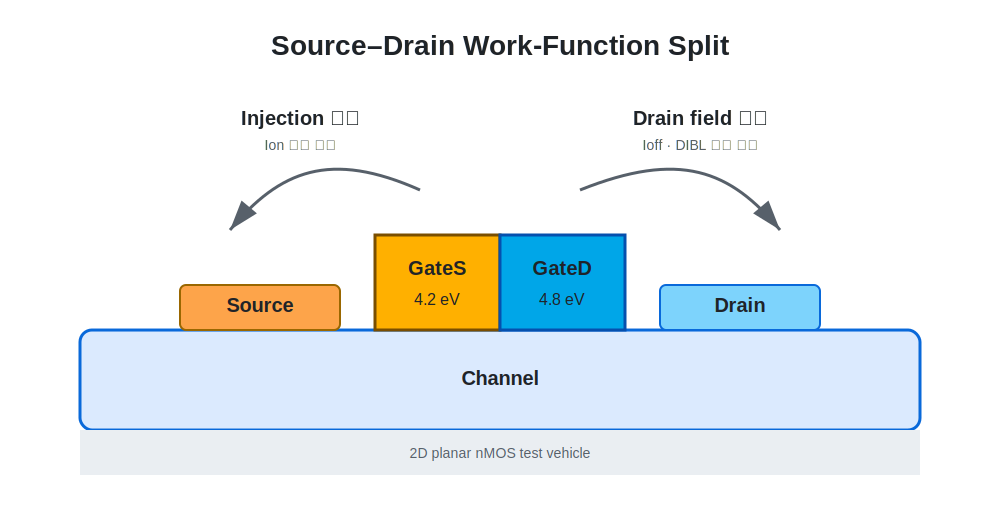
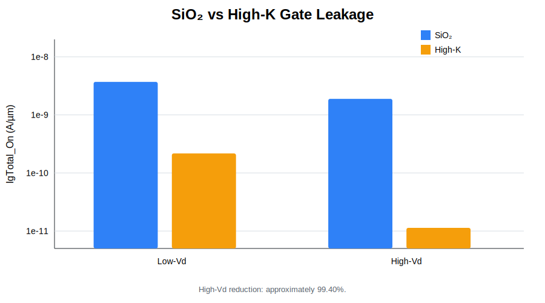

# TCAD Dual-Metal-Gate MOSFET Feasibility Study

2D planar nMOS TCAD test vehicle에서 **source–drain 방향 Work-Function Split**의 물리적 효과를 검증하고, thin-SiO₂ gate leakage와 gate-length ratio에 따른 trade-off를 분석한 연구입니다.

이 프로젝트는 생산 가능한 planar DMG 공정을 제안하거나 단일 최적값을 주장하는 작업이 아닙니다. 복잡한 GAA·nanosheet·CFET 구조로 확장하기 전, Dual-Metal Gate의 기본적인 electrostatic effect를 분리해 확인한 **feasibility and physical-verification study**입니다.

**Summary:**  
This study uses a 2D Sentaurus TCAD test vehicle to examine source–drain work-function splitting, gate leakage mitigation with a high-k stack, and gate-ratio trade-offs. The result is framed as a concept study rather than a production-ready process claim.

---

## Research at a Glance

| Item | Description |
|---|---|
| Tool | Synopsys Sentaurus T-2022.03: Workbench, SProcess, SDevice, SVisual |
| Device | 2D planar nMOS test vehicle |
| Gate configuration | GateS 4.2 eV / GateD 4.8 eV |
| Scaling study | Lg = 0.25, 0.10, 0.028 µm |
| Gate stack extension | SiO₂ 1.6 nm → SiO₂ IL 0.5 nm + HfO₂ 5.64 nm |
| Main metrics | DIBL, SS, Ion, Ioff, Ion/Ioff, Ig |
| Team | 이선재, 주상현 |



---

## Key Findings

- Single-Metal Gate와 Dual-Metal Gate를 세 gate length에서 비교했을 때, DMG 조건은 **Ion이 소폭 감소하는 대신 Ioff와 Ion/Ioff가 크게 개선되는 방향**을 반복적으로 보였습니다.
- 초기 Vtgm 기반 DIBL에서 비정상적인 값이 발견되어, `Vd/2` correction과 constant-current threshold를 추가했습니다.
- 동일 EOT 약 1.6 nm에서 SiO₂ IL/HfO₂ stack을 적용해 물리 두께를 6.14 nm로 늘렸고, 대표 High-Vd 조건에서 `IgTotal_On`이 **약 99.40% 감소**했습니다.
- Drain-side high-WF gate 비율이 증가하면 Ioff·SS·Ig는 개선되는 경향을 보였지만 Ion은 소폭 감소하고 DIBL은 비단조적으로 변했습니다.



---

## Read the Study

| Page | Content |
|---|---|
| [Project Page](https://jujushmaterial.github.io/TCAD-Dual-Metal-Gate-MOSFET-Feasibility-Study/) | 연구 질문과 핵심 결과 |
| [Navigation](./guide/00_navigation.md) | 상세 문서 전체 안내 |
| [Project Evolution](./guide/02_project_evolution.md) | 수업 프로젝트에서 학회 발표까지 |
| [Literature and Framing](./guide/03_literature_and_research_framing.md) | GAA·CFET 문헌과 연구 범위 |
| [DMG Physical Concept](./guide/04_dmg_physical_concept.md) | Work-Function Split 가설 |
| [TCAD Implementation](./guide/05_tcad_test_vehicle_and_process.md) | SProcess–SDevice–SVisual 흐름 |
| [Scaling Verification](./guide/06_scaling_verification.md) | 0.25/0.10/0.028 µm 비교 |
| [DIBL Reliability](./guide/07_dibl_extraction_and_reliability.md) | 추출 오류와 개선 |
| [Gate Leakage](./guide/08_gate_leakage_problem.md) | Thin-SiO₂ Ig 문제 |
| [High-K Stack](./guide/09_high_k_gate_stack.md) | EOT 유지와 Ig 감소 |
| [Gate-Ratio Trade-off](./guide/10_gate_ratio_tradeoff.md) | 6:4–3.5:6.5 비교 |
| [Conclusion](./guide/11_conclusion_and_future_research.md) | 한계와 GAA·CFET 확장 방향 |
| [Full TCAD Code](./guide/12_reproducibility_and_code.md) | 실행 코드 전문과 재현 범위 |
| [Conference Presentation](./presentation/conference_presentation_outline.md) | 최종 학회 발표 흐름 |
| [References](./references/bibliography.md) | DOI와 연구 내 역할 |

---

## Full Code Sets

```text
source/
├── coursework/                         # 최초 수업 구현본
├── verified/sio2_ig_baseline/          # SiO₂ DMG + gate tunneling
├── verified/highk_eot1p6_gate_ratio/   # High-K + ratio + corrected DIBL
└── extended/highk_eot_sweep/           # 후속 EOT sweep 확장본
```

각 폴더에서 SProcess, SDevice, SVisual, parameter file 전문을 확인할 수 있습니다.

---

## Research Scope

- 본 결과는 2D planar test vehicle의 상대 비교입니다.
- `Lg = 0.028 µm`는 상용 28 nm 공정 전체를 재현했다는 의미가 아닙니다.
- High-K tunneling parameter는 calibrated absolute prediction이 아니라 동일 framework 내 first-pass trend comparison입니다.
- GAA·CFET 적용은 실증 결과가 아니라 후속 연구 방향입니다.
- 일부 발표 raw table의 DIBL은 초기 Vtgm extraction 영향을 포함하므로, 최종 해석은 여러 지표의 경향을 함께 사용합니다.

---

## AI Assistance Disclosure

OpenAI ChatGPT는 code 초안·수정, 계산, 결과 비교, 발표 구조화와 일부 개념도 제작을 보조했습니다. 모든 command는 Sentaurus Workbench에서 직접 실행해 구조·curve·DOE output을 확인했고, 최종 데이터 선택과 해석 범위는 연구 참여자가 검토했습니다.
