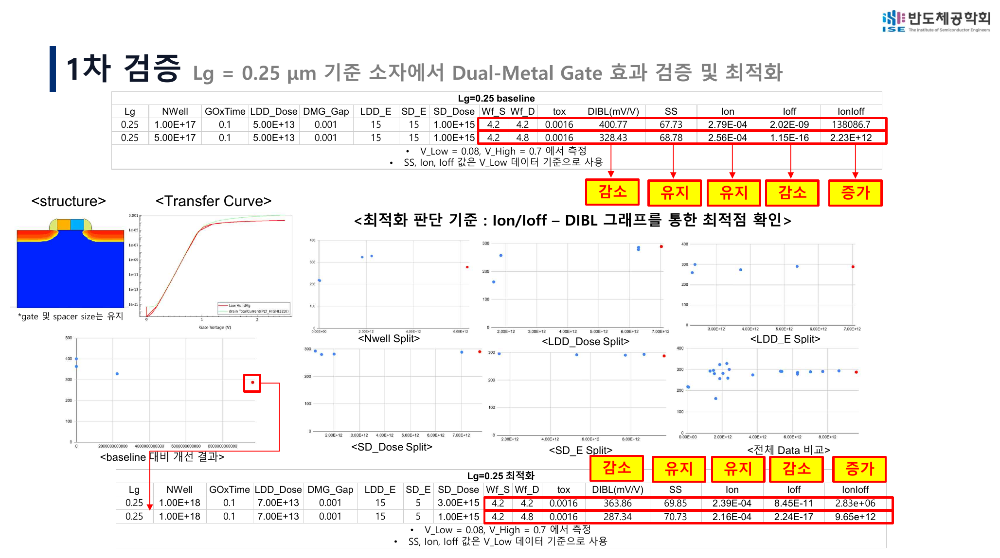
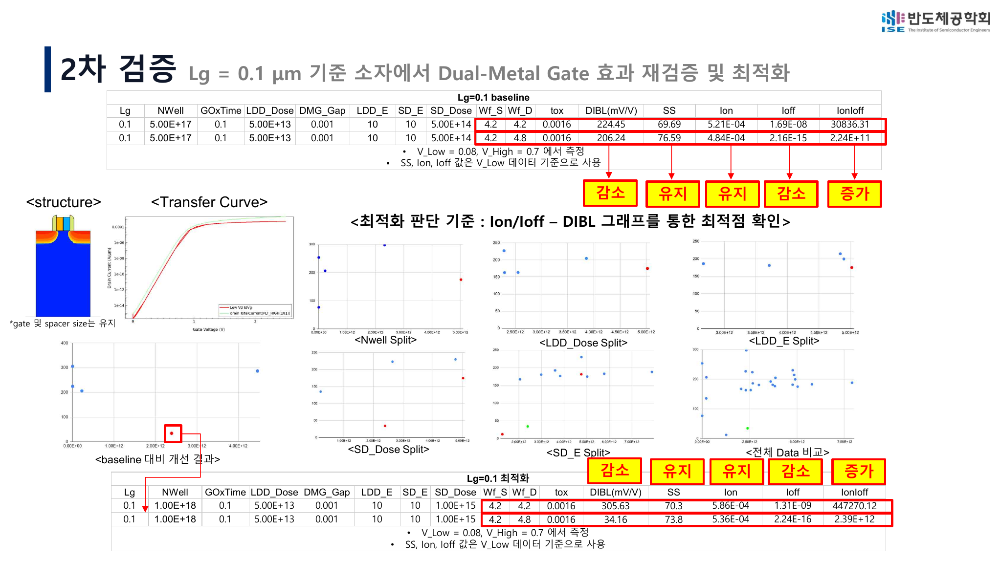
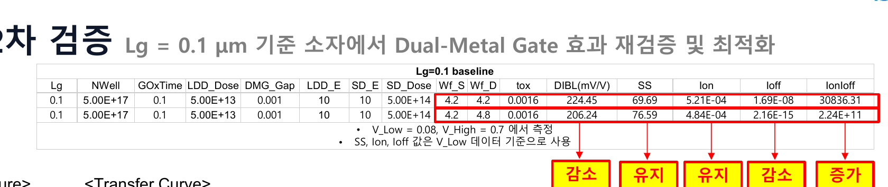
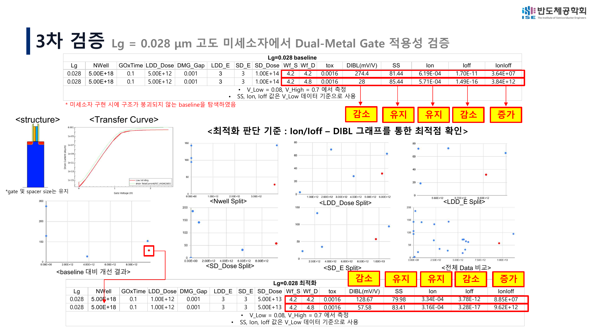
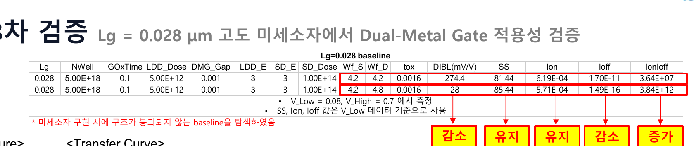

# Parameter Screening and Comparative Optimization

[← 전체 연구](../study/index.html) · [프로젝트 첫 페이지](../index.html)

이 프로젝트의 핵심은 절대적인 공정 최적점을 주장하는 것이 아니라, 서로 다른 gate length에서도 Dual-Metal Gate의 상대적 효과를 검증할 수 있도록 **안정적인 비교 조건을 찾는 과정**이었습니다.

따라서 여기서 사용하는 `optimization`은 다음 의미입니다.

> 공정 변수를 screening하고, Ion/Ioff와 DIBL을 중심으로 여러 지표를 함께 비교해 Single-Metal Gate와 Dual-Metal Gate를 동일 조건에서 평가할 representative condition을 선택하는 과정

---

## 1. 비교 변수와 선정 기준

### Screening variables

- `NWell`
- `LDD_Dose`
- `LDD_E`
- `SD_Dose`
- `SD_E`

GateS/GateD work function은 Single과 Dual 비교를 위해 각각 다음과 같이 사용했습니다.

```text
Single-Metal Gate: Wf_S = 4.2 eV, Wf_D = 4.2 eV
Dual-Metal Gate  : Wf_S = 4.2 eV, Wf_D = 4.8 eV
```

### Decision metrics

1. Ion/Ioff가 높을 것
2. DIBL이 낮을 것
3. Ion이 급격히 감소하지 않을 것
4. SS가 과도하게 악화되지 않을 것
5. 공정 simulation에서 구조가 안정적으로 형성될 것

단일 지표의 최고점만 선택하지 않고, `Ion/Ioff–DIBL` scatter와 SS·Ion·Ioff를 함께 비교했습니다.

---

## 2. Lg = 0.25 μm

### 역할

- DMG 구조의 첫 구현
- Single–Dual 기본 방향성 확인
- 공정변수 screening 절차 수립



### Baseline

| Gate | NWell | LDD dose | LDD E | SD dose | SD E | DIBL | SS | Ion | Ioff | Ion/Ioff |
|---|---:|---:|---:|---:|---:|---:|---:|---:|---:|---:|
| Single | 1.0e17 | 5.0e13 | 15 | 1.0e15 | 15 | 400.77 | 67.73 | 2.79e-4 | 2.02e-9 | 1.38e5 |
| Dual | 5.0e17 | 5.0e13 | 15 | 1.0e15 | 15 | 328.43 | 68.78 | 2.56e-4 | 1.15e-16 | 2.23e12 |


### Parameter screening


선정 과정에서는 NWell, LDD dose/energy, SD dose/energy에 따른 분포를 확인하고 전체 데이터 비교에서 representative point를 선택했습니다.

### Selected condition

| Gate | NWell | LDD dose | LDD E | SD dose | SD E | DIBL | SS | Ion | Ioff | Ion/Ioff |
|---|---:|---:|---:|---:|---:|---:|---:|---:|---:|---:|
| Single | 1.0e18 | 7.0e13 | 15 | 3.0e15 | 5 | 363.86 | 69.85 | 2.39e-4 | 8.45e-11 | 2.83e6 |
| Dual | 1.0e18 | 7.0e13 | 15 | 1.0e15 | 5 | 287.34 | 70.73 | 2.16e-4 | 2.24e-17 | 9.65e12 |


### Interpretation

- DMG에서 Ion은 소폭 감소
- DIBL과 Ioff 감소 방향 확인
- Ion/Ioff 크게 증가
- SS는 비슷한 수준을 유지

이 단계에서 parameter screening 방식과 비교 프레임을 확립했습니다.

---

## 3. Lg = 0.10 μm

### 역할

- gate length 감소 후 효과 재현성 확인
- 첫 단계와 같은 screening 논리 적용



### Baseline

| Gate | NWell | LDD dose | LDD E | SD dose | SD E | DIBL | SS | Ion | Ioff | Ion/Ioff |
|---|---:|---:|---:|---:|---:|---:|---:|---:|---:|---:|
| Single | 5.0e17 | 5.0e13 | 10 | 5.0e14 | 10 | 224.45 | 69.69 | 5.21e-4 | 1.69e-8 | 3.08e4 |
| Dual | 5.0e17 | 5.0e13 | 10 | 5.0e14 | 10 | 206.24 | 76.59 | 4.84e-4 | 2.16e-15 | 2.24e11 |



### Parameter screening


### Selected condition

| Gate | NWell | LDD dose | LDD E | SD dose | SD E | DIBL | SS | Ion | Ioff | Ion/Ioff |
|---|---:|---:|---:|---:|---:|---:|---:|---:|---:|---:|
| Single | 1.0e18 | 5.0e13 | 10 | 1.0e15 | 10 | 305.63 | 70.30 | 5.86e-4 | 1.31e-9 | 4.47e5 |
| Dual | 1.0e18 | 5.0e13 | 10 | 1.0e15 | 10 | 34.16 | 73.80 | 5.36e-4 | 2.24e-16 | 2.39e12 |


### Interpretation

- 0.25 μm와 마찬가지로 Ion은 일부 감소
- Ioff와 Ion/Ioff의 강한 개선 방향 반복
- DIBL 감소 방향 확인
- SS trade-off 존재

이 단계는 DMG 효과가 하나의 geometry에서만 나타난 현상이 아닌지 확인하는 재검증 역할을 했습니다.

---

## 4. Lg = 0.028 μm

### 역할

- 미세 구조에서의 적용성 확인
- 공정 simulation 중 구조가 붕괴하지 않는 baseline 탐색
- scaling 과정에서 발생하는 신뢰성 문제 확인



### Scaling-stage baseline

| Gate | NWell | LDD dose | LDD E | SD dose | SD E | DIBL | SS | Ion | Ioff | Ion/Ioff |
|---|---:|---:|---:|---:|---:|---:|---:|---:|---:|---:|
| Single | 5.0e18 | 5.0e12 | 3 | 1.0e14 | 3 | 274.40 | 81.44 | 6.19e-4 | 1.70e-11 | 3.64e7 |
| Dual | 5.0e18 | 5.0e12 | 3 | 1.0e14 | 3 | 28.00* | 85.44 | 5.71e-4 | 1.49e-16 | 3.84e12 |

`*` 초기 Vtgm extraction에 민감한 값입니다.



### Parameter screening


0.028 μm 단계에서는 지표뿐 아니라 구조가 SProcess에서 안정적으로 형성되는지도 선정 조건에 포함했습니다.

### Scaling-stage selected condition

| Gate | NWell | LDD dose | LDD E | SD dose | SD E | DIBL | SS | Ion | Ioff | Ion/Ioff |
|---|---:|---:|---:|---:|---:|---:|---:|---:|---:|---:|
| Single | 5.0e18 | 1.0e12 | 3 | 5.0e13 | 3 | 128.67 | 79.98 | 3.34e-4 | 3.78e-12 | 8.85e7 |
| Dual | 5.0e18 | 1.0e12 | 3 | 5.0e13 | 3 | 57.58 | 83.41 | 3.16e-4 | 3.28e-17 | 9.62e12 |


### Interpretation

- 미세 구조에서도 DMG의 Ioff 및 Ion/Ioff 개선 방향 유지
- Ion은 일부 감소
- SS trade-off 존재
- DIBL은 extraction method에 민감
- structure stability를 포함한 조건 선정 필요

---

## 5. 세 단계의 의미

| Scale | Main role | What was learned |
|---:|---|---|
| 0.25 μm | 1차 검증 | DMG 구현과 screening 방법 수립 |
| 0.10 μm | 재검증 | 동일한 상대적 방향이 반복되는지 확인 |
| 0.028 μm | 미세화 적용성 | 구조 안정성, leakage, extraction 한계 발견 |

### 반복된 결과 방향

- Ion: 소폭 감소
- Ioff: 큰 폭 감소
- Ion/Ioff: 큰 폭 증가
- DIBL: 감소 방향이지만 extraction sensitivity 존재
- SS: 조건별 trade-off

---

## 6. 왜 이 과정을 절대 최적화라고 부르지 않는가

선정 조건은 제한된 parameter range, mesh, physics model, Workbench 환경 안에서 얻은 representative point입니다.

다음 항목을 모두 탐색한 global optimum이 아닙니다.

- 모든 implant profile과 anneal condition
- quantum correction
- interface trap과 process variation
- contact resistance
- 실제 lithography와 metal transition
- GAA·CFET 3D geometry

따라서 본 포트폴리오는 다음 표현을 사용합니다.

- parameter screening
- comparative optimization
- selected condition
- balanced reference
- feasibility study

다음 표현은 사용하지 않습니다.

- production-ready optimum
- globally optimized device
- final manufacturable process

---

## Related materials

- [전체 연구 본문](../study/index.html)
- [데이터 단계와 DIBL 신뢰성](./data_lineage_and_reliability.html)
- [결과 CSV](../results/index.html)
- [TCAD source](../source/index.html)
