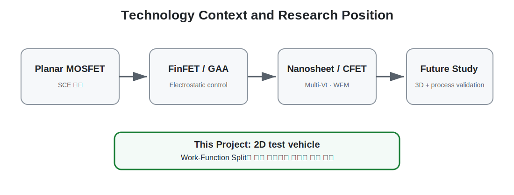

# 01. Research Overview

[← Navigation](./00_navigation.html) · [Project Page](../index.html)

| Item | Description |
|---|---|
| Study type | TCAD feasibility and physical-verification study |
| Test vehicle | 2D planar nMOS |
| Main variable | Source-side and drain-side gate work function |
| Extensions | Gate leakage model, High-K stack, GateS/GateD length ratio |
| Evaluation | DIBL, SS, Ion, Ioff, Ion/Ioff, Ig |
| Final context | Future GAA·nanosheet·CFET Work-Function Engineering |

## One-Sentence Definition

2D MOSFET TCAD test vehicle을 이용해 source–drain 방향 Work-Function Split이 short-channel effect와 leakage에 미치는 영향을 검증하고, High-K gate stack과 gate-ratio engineering을 통해 추가 문제와 trade-off를 분석한 연구입니다.

## What Was Verified

1. Single-Metal Gate와 DMG의 상대적 전기 특성
2. Lg scaling에 따라 동일한 방향성이 반복되는지
3. Thin-SiO₂에서 gate tunneling current가 새로운 한계가 되는지
4. 동일 EOT의 High-K stack이 Ig를 낮추는 방향을 보이는지
5. GateS/GateD 비율이 source injection과 drain suppression의 균형을 어떻게 바꾸는지
6. DIBL extraction 자체가 결과 해석에 미치는 영향

## What Was Not Claimed

- 생산 가능한 planar DMG 공정 완성
- 상용 28 nm process design rule 재현
- 3D GAA·CFET 소자 직접 simulation
- High-K leakage 절대값 calibration
- 모든 지표를 동시에 최대화하는 유일한 최적 ratio

## Core Research Message

DMG의 목적은 단순히 Ion을 증가시키는 것이 아닙니다. Source-side low-WF gate는 carrier injection 유지에, drain-side high-WF gate는 drain field penetration과 off-state leakage 억제에 기여할 수 있습니다. 연구 결과는 이 역할 분리가 Ioff와 Ion/Ioff에 강한 영향을 줄 수 있음을 보여주었고, 동시에 Ion·SS·DIBL·Ig 사이의 trade-off도 드러냈습니다.

