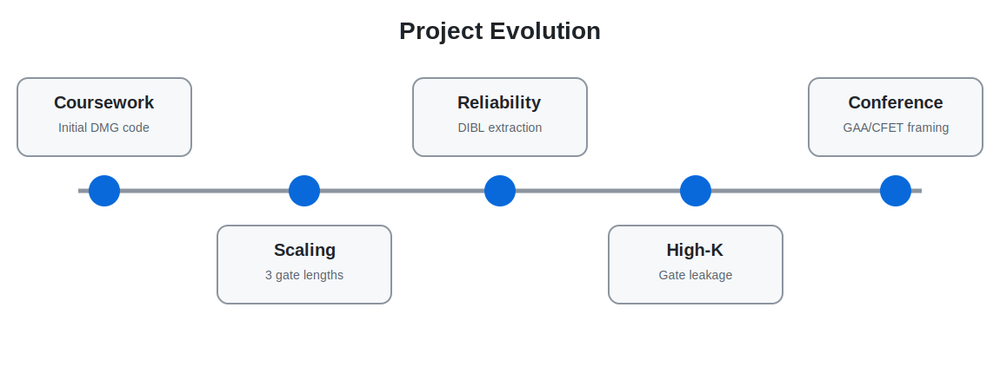
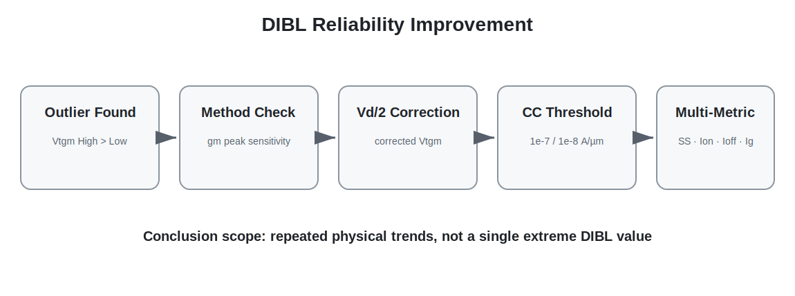
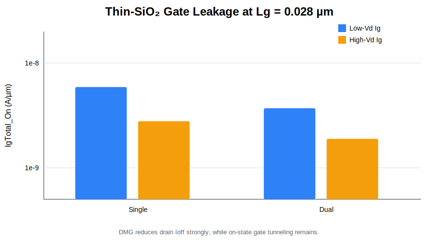
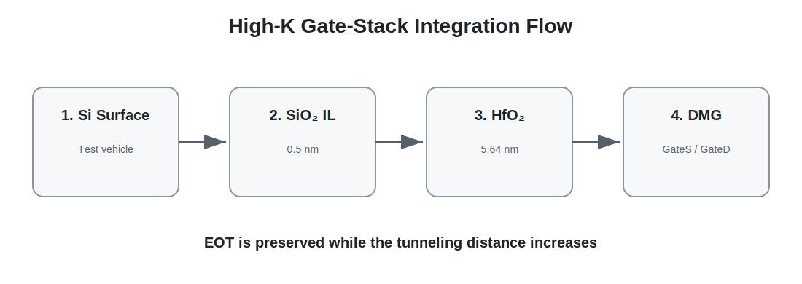

# 02. Project Evolution

[← Navigation](./00_navigation.html)

## Stage 1 — Coursework Project

반도체집적공정 기말 프로젝트에서 SimpleMOS 기반 nMOS 구조를 source-side GateS와 drain-side GateD로 분리했습니다. 초기 목표는 Single-Metal Gate와 Dual-Metal Gate를 비교해 DIBL과 Ioff의 변화를 확인하는 것이었습니다.

초기 코드에는 다음이 구현됐습니다.

- Titanium GateS / Tungsten GateD 구조 분리
- `Wf_S`, `Wf_D` electrode parameter
- Low-Vd 및 High-Vd Id–Vg sweep
- Vtgm, SS, gm, Ion, Ioff, Ion/Ioff, DIBL 자동 추출

## Stage 2 — Scaling and Competition Preparation

Lg를 0.25 → 0.10 → 0.028 µm로 줄이며 동일한 방향성이 반복되는지 확인했습니다. 이 단계에서는 parameter split 결과를 비교했으나, 이후 포트폴리오에서는 이를 “절대 최적화”가 아니라 **comparative parameter study**로 재해석했습니다.

## Stage 3 — Reliability Reassessment

일부 조건에서 `Vtgm_High > Vtgm_Low`가 나타나 일반적인 DIBL 방향과 어긋나는 값을 발견했습니다. 이를 계기로 결과표 자체보다 threshold extraction method를 재검토했고, corrected Vtgm과 constant-current Vth를 추가했습니다.

## Stage 4 — Gate Leakage and High-K

Lg = 0.028 µm 구조의 약 1.6 nm SiO₂에서 gate tunneling을 별도로 계산했습니다. Drain-current 기반 Ioff가 크게 줄어도 on-state Ig가 남는 것을 확인한 뒤, EOT를 유지하면서 물리 두께를 늘리는 SiO₂ IL/HfO₂ stack을 도입했습니다.

<figure><figcaption>Id 중심 평가에서 gate terminal leakage까지 확장한 시점.</figcaption></figure>
<figure><figcaption>동일 EOT의 High-K stack을 추가한 학회 발표 단계.</figcaption></figure>

## Stage 5 — Gate-Ratio Study and Conference Framing

GateS:GateD를 6:4, 5:5, 4.5:5.5, 3.5:6.5로 바꾸어 source injection과 drain suppression의 역할 분리를 분석했습니다. 학회 발표 준비 과정에서는 planar DMG가 최신 양산 공정을 대체한다는 표현을 버리고, GAA·CFET WFM engineering으로 확장하기 전의 **2D concept study**로 연구 범위를 재정의했습니다.

<figure><figcaption>최종 연구 방향성.</figcaption></figure>
<figure><figcaption>학회 발표의 최종 결론과 한계.</figcaption></figure>

