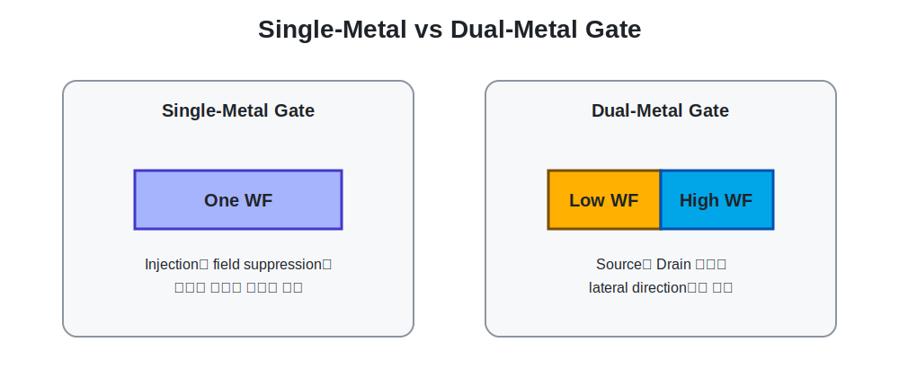
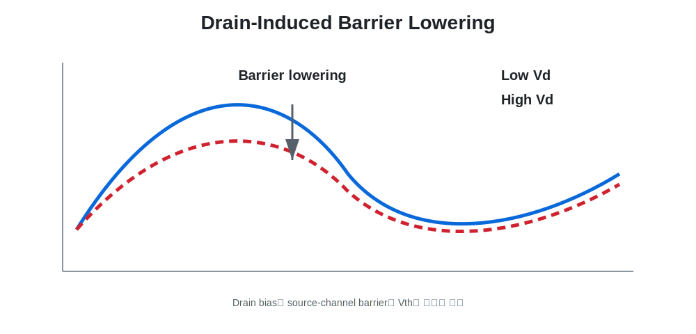

# 04. Dual-Metal-Gate Physical Concept

[← Navigation](./00_navigation.html)


## Hypothesis

Single-Metal Gate는 source injection과 drain field suppression을 하나의 work function으로 동시에 조절해야 합니다. DMG는 gate를 lateral direction으로 나누어 두 역할을 분리합니다.

| Region | Representative WF | Intended Role |
|---|---:|---|
| GateS, source side | 4.2 eV | Source-channel injection barrier를 낮게 유지해 Ion 손실 제한 |
| GateD, drain side | 4.8 eV | Drain field penetration과 barrier lowering 억제 |

## Expected Metric Changes

| Metric | Initial Expectation | Reason |
|---|---|---|
| Ion | 유지 또는 소폭 감소 | GateS의 low WF가 injection을 유지하지만 GateD가 channel 일부를 더 강하게 제어 |
| Ioff | 감소 | Drain-side high WF가 off-state barrier lowering 억제 |
| DIBL | 감소 방향 | Drain field의 source barrier 영향 감소 |
| SS | 유지 또는 trade-off | barrier control과 gate partition의 복합 영향 |
| Ion/Ioff | 증가 | Ion 손실보다 Ioff 감소 이득이 클 가능성 |

<div class="image-grid">
<figure><figcaption>Single-Metal Gate와 DMG 구조 비교.</figcaption></figure>
<figure><figcaption>Drain bias가 source-channel barrier에 미치는 영향.</figcaption></figure>
</div>

## DIBL Definition

```text
DIBL = |Vth,LowVd − Vth,HighVd| / |Vd,High − Vd,Low|
```

이 연구에서는 `Vd_Low = 0.08 V`, `Vd_High = 0.7 V`를 대표 조건으로 사용했습니다. 다만 Vth extraction method가 DIBL에 직접 영향을 주므로, 최종 해석은 [DIBL Extraction and Reliability](./07_dibl_extraction_and_reliability.html)에서 별도로 다룹니다.
