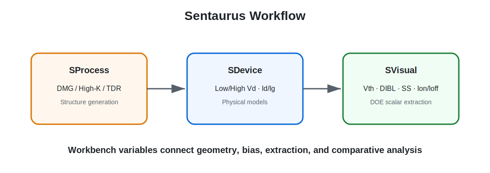
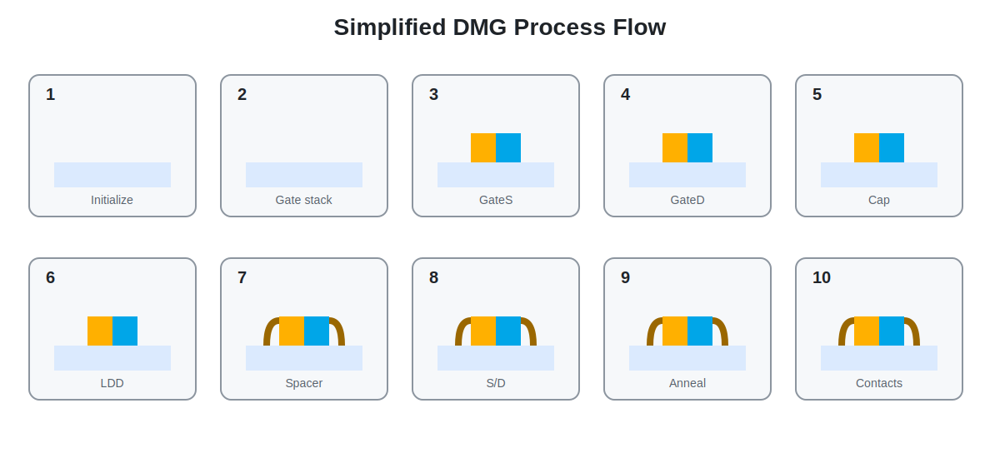

# 05. TCAD Test Vehicle and Process

[← Navigation](./00_navigation.html) · [Full Source](../source/README.html)

## Environment

- Synopsys Sentaurus T-2022.03
- Sentaurus Workbench
- SProcess, SDevice, SVisual
- MobaXterm remote connection to the university Linux server



## SProcess: Lateral DMG Structure

2D coordinate에서 `y < 0`을 source side, `y > 0`을 drain side로 정의했습니다. 기존 SimpleMOS의 mirror-based structure는 DMG의 lateral asymmetry를 보존할 수 없어 `transform reflect`를 사용하지 않았습니다.

핵심 구현은 다음과 같습니다.

- GateS material: Titanium
- GateD material: Tungsten
- 실제 work function: SDevice electrode parameter로 부여
- 두 gate 사이에 `DMG_Gap`
- implant penetration을 막기 위한 temporary gate/gap nitride cap
- LDD, spacer, Source/Drain implant와 anneal
- GateS/GateD contact 분리
- ratio sweep에서 gate center가 자동 이동하도록 parameterization



## Gate-Ratio Parameterization

```text
LMetal = Lg − DMG_Gap
GateS_Len = DMG_RatioS × LMetal
GateD_Len = (1 − DMG_RatioS) × LMetal
```

절대 길이를 따로 입력하지 않고 전체 gate region과 gap을 고정한 채 두 metal의 비율만 변경했습니다. 이 방식은 총 길이가 Lg를 초과하는 coordinate error를 방지합니다.

## SDevice

- `gateS`와 `gateD`에 독립적인 Workfunction 지정
- 두 gate는 동일한 gate voltage로 동시에 sweep
- Low-Vd와 High-Vd에서 각각 Id–Vg 계산
- mobility: PhuMob, HighFieldSaturation, Enormal
- recombination: SRH with DopingDependence
- gate leakage stage에서는 gateS/gateD electrode 기반 NonLocal barrier tunneling mesh 추가

## SVisual

초기 버전은 Vtgm, SS, gm, Ion, Ioff, Ion/Ioff, DIBL을 추출했습니다. 최종 버전은 다음까지 확장했습니다.

- IgS, IgD, IgTotal at off/operation/on
- corrected Vtgm
- constant-current Vth at `1e-7` and `1e-8 A/µm`
- signed and absolute DIBL
- threshold crossing valid flag
- Workbench DOE scalar output

<div class="callout">
코드 전문은 `source/` 아래에서 초기 수업본, 검증 완료본, 후속 확장본으로 구분해 공개했습니다.
</div>
