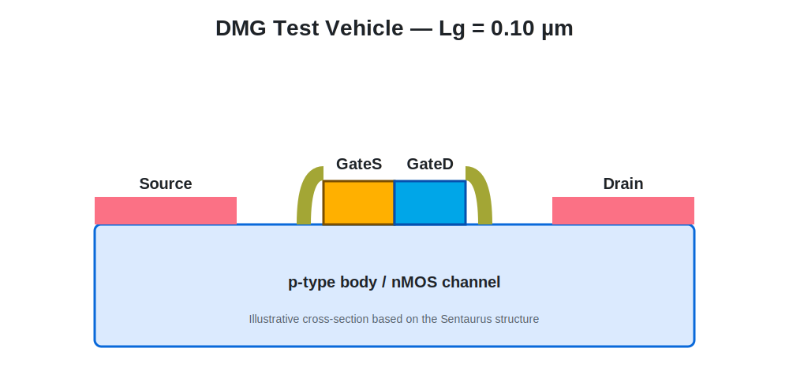
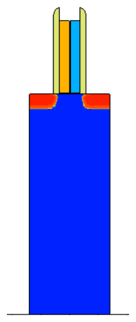
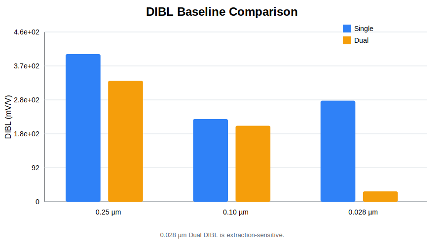
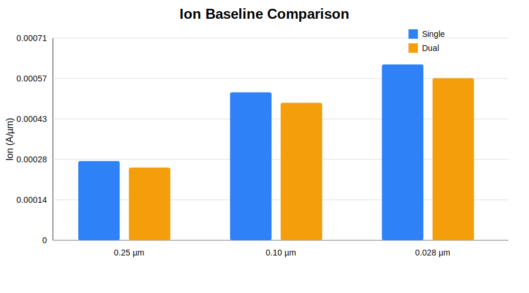
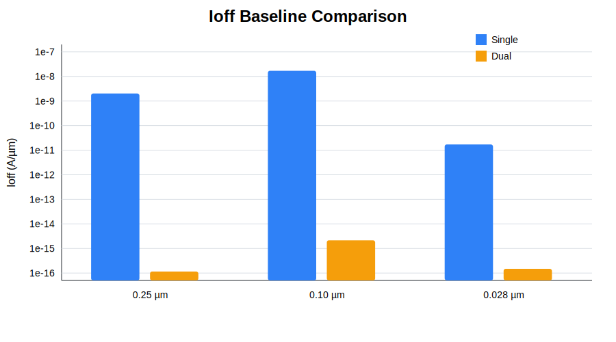
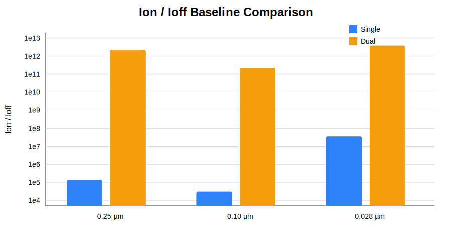

# 06. Scaling Verification

[← Navigation](./00_navigation.html) · [Scaling CSV](../results/scaling_baseline.csv)

## Purpose

DMG 효과가 하나의 geometry에만 나타나는지 확인하기 위해 Lg = 0.25, 0.10, 0.028 µm에서 Single-Metal Gate와 Dual-Metal Gate를 비교했습니다.

<figure><figcaption>Lg = 0.25 µm 구조 요약도.</figcaption></figure>
<figure><figcaption>Lg = 0.10 µm 구조 요약도.</figcaption></figure>
<figure><figcaption>Sentaurus SVisual에서 확인한 Lg = 0.028 µm 실제 구조.</figcaption></figure>

## Baseline Comparison

| Lg (µm) | Gate | DIBL (mV/V) | SS (mV/dec) | Ion (A/µm) | Ioff (A/µm) | Ion/Ioff |
|---:|---|---:|---:|---:|---:|---:|
| 0.25 | Single | 400.77 | 67.73 | 2.79e-4 | 2.02e-9 | 1.38e5 |
| 0.25 | Dual | 328.43 | 68.78 | 2.56e-4 | 1.15e-16 | 2.23e12 |
| 0.10 | Single | 224.45 | 69.69 | 5.21e-4 | 1.69e-8 | 3.08e4 |
| 0.10 | Dual | 206.24 | 76.59 | 4.84e-4 | 2.16e-15 | 2.24e11 |
| 0.028 | Single | 274.40 | 81.44 | 6.19e-4 | 1.70e-11 | 3.64e7 |
| 0.028 | Dual | 28.00* | 85.44 | 5.71e-4 | 1.49e-16 | 3.84e12 |

`*` 0.028 µm의 DIBL 절대값은 초기 Vtgm extraction에 민감하므로 경향 확인용으로만 사용했습니다.

<figure><figcaption>DIBL baseline comparison. 절대값의 신뢰도는 extraction method와 함께 평가했습니다.</figcaption></figure>
<figure><figcaption>DMG에서 Ion은 약 7–8% 수준으로 감소했습니다.</figcaption></figure>
<figure><figcaption>Ioff는 모든 scale에서 크게 감소하는 방향을 보였습니다.</figcaption></figure>
<figure><figcaption>Ion 손실보다 Ioff 감소가 크게 나타나 Ion/Ioff가 증가했습니다.</figcaption></figure>

## Interpretation

세 geometry에서 수치 크기와 SS trade-off는 달랐지만 다음 방향이 반복됐습니다.

- Ion: 소폭 감소
- Ioff: 큰 폭 감소
- Ion/Ioff: 큰 폭 증가
- DIBL: 대체로 감소하지만 extraction에 민감
- SS: scale과 condition에 따라 trade-off 존재

이 비교는 DMG의 electrostatic directionality를 확인한 결과입니다. 최종 양산 구조나 절대 최적 process condition을 의미하지 않습니다.

