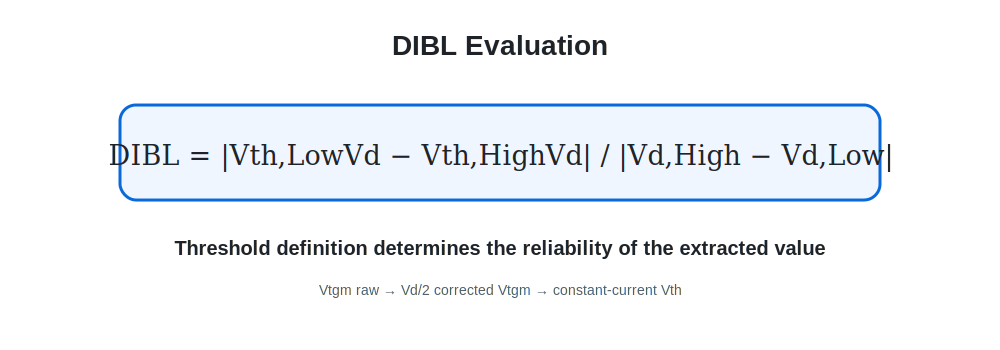

# 07. DIBL Extraction and Reliability

[← Navigation](./00_navigation.html) · [Final SVisual Code](../source/verified/highk_eot1p6_gate_ratio/svisual.tcl)

## Problem Found

초기 SVisual은 gm peak의 linear extrapolation을 사용했습니다.

```text
VtgmRaw = Vgm − Id(Vgm) / gmmax
```

일부 DMG·High-K·ratio 조건에서 `Vtgm_High > Vtgm_Low`가 나타나 일반적인 DIBL 방향과 반대인 결과가 추출됐습니다. 이는 구조 자체의 성능으로 바로 해석하기보다 gm peak 이동과 threshold definition의 영향을 먼저 의심해야 하는 신호였습니다.



## Improvement 1 — Drain-Bias Correction

최종 코드에서는 gm extrapolation에 drain-bias correction을 추가했습니다.

```text
Vtgm = Vgm − Id(Vgm)/gmmax − Vd/2
```

## Improvement 2 — Constant-Current Threshold

Primary DIBL을 constant-current threshold로 변경했습니다.

- CC1: `Id = 1e-7 A/µm`
- CC2: `Id = 1e-8 A/µm`
- log-current interpolation
- target crossing 여부를 valid flag로 기록
- signed DIBL과 absolute DIBL을 모두 출력


## Final Data Policy

1. 극단적으로 낮거나 비단조적인 DIBL 하나만으로 조건을 선정하지 않음
2. threshold crossing valid flag 확인
3. corrected Vtgm과 CC1/CC2를 diagnostic으로 비교
4. SS, Ion, Ioff, Ion/Ioff, Ig와 함께 해석
5. 기존 학회 raw table의 초기 DIBL 값은 삭제하지 않고 신뢰도 한계를 표시

## Why This Matters

이 과정은 “좋은 숫자를 얻었다”보다 중요합니다. Simulation output을 그대로 수용하지 않고 extraction algorithm의 가정과 적용 범위를 점검했으며, 최종 결론을 절대 최적값에서 반복되는 물리적 경향으로 제한했습니다.
