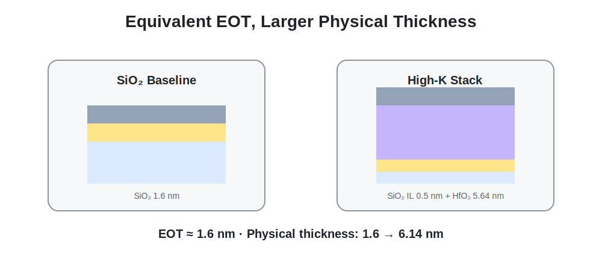
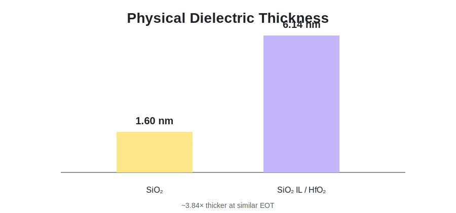

# 09. High-K Gate Stack

[← Navigation](./00_navigation.html) · [High-K CSV](../results/high_k_comparison.csv) · [Verified Code](../source/verified/highk_eot1p6_gate_ratio/README.html)

## Design Objective

EOT를 약 1.6 nm로 유지하면서 physical dielectric thickness를 증가시켜 tunneling probability를 줄이는 것이 목적이었습니다.



```text
Original: Si / SiO₂ 1.6 nm / DMG
High-K : Si / SiO₂ IL 0.5 nm / HfO₂ 5.64 nm / DMG
```

## EOT Calculation

```text
EOT = T_IL + T_HK × k_SiO2 / k_HfO2
    = 0.5 nm + 5.64 nm × 3.9 / 20
    ≈ 1.5998 nm
```

총 physical thickness는 6.14 nm로, 기존 1.6 nm SiO₂보다 약 3.84배 두꺼워졌습니다.

<div class="image-grid">
<figure><figcaption>동일 EOT에서 물리 두께 증가.</figcaption></figure>
<figure><figcaption>SiO₂ IL/HfO₂/DMG 최종 구조.</figcaption></figure>
</div>

## Gate Leakage Result

| Bias condition | SiO₂ IgTotal_On | High-K IgTotal_On | Reduction |
|---|---:|---:|---:|
| Low-Vd | 3.7051e-9 | 2.1700e-10 | 94.14% |
| High-Vd | 1.8897e-9 | 1.1350e-11 | 99.40% |

<div class="image-grid">
<figure><figcaption>High-K structure의 gate-current curve.</figcaption></figure>
<figure><figcaption>대표 조건에서의 SiO₂–High-K Ig 비교.</figcaption></figure>
</div>

## Interpretation Limit

HfO₂ tunneling mass는 동일 simulation framework 내 relative trend를 비교하기 위한 first-pass parameter입니다. Interface trap, band offset, process damage, calibrated tunneling parameter가 모두 포함된 절대 leakage prediction은 아닙니다.


