# 10. GateS/GateD Ratio Trade-off

[← Navigation](./00_navigation.html) · [Gate-Ratio CSV](../results/gate_ratio_tradeoff.csv)

## Hypothesis

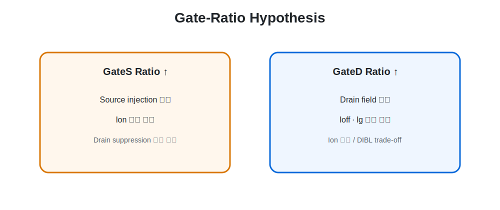

- GateD 비율 증가: drain field suppression 강화, Ioff·Ig 감소 가능, GateS 축소로 Ion 감소 가능
- GateS 비율 증가: source injection 유지에 유리, drain-side suppression 영역 감소 가능

## Conditions

| GateS:GateD | GateS length | GateD length |
|---|---:|---:|
| 6:4 | 16.20 nm | 10.80 nm |
| 5:5 | 13.50 nm | 13.50 nm |
| 4.5:5.5 | 12.15 nm | 14.85 nm |
| 3.5:6.5 | 9.45 nm | 17.55 nm |

<figure>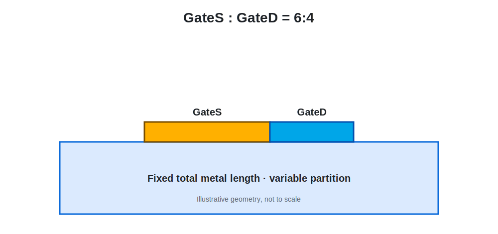<figcaption>GateS:GateD = 6:4</figcaption></figure>
<figure>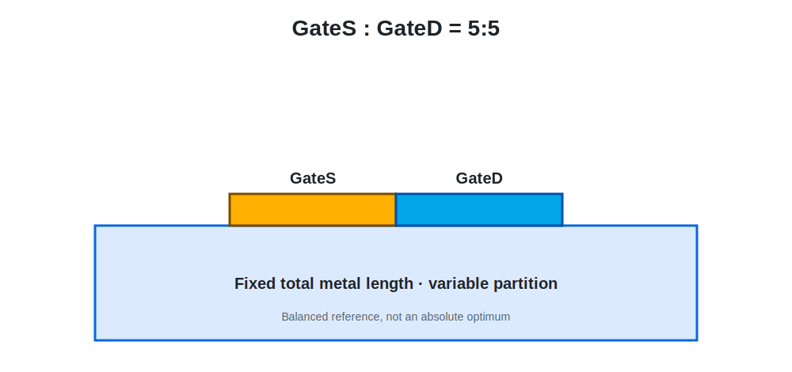<figcaption>GateS:GateD = 5:5</figcaption></figure>
<figure>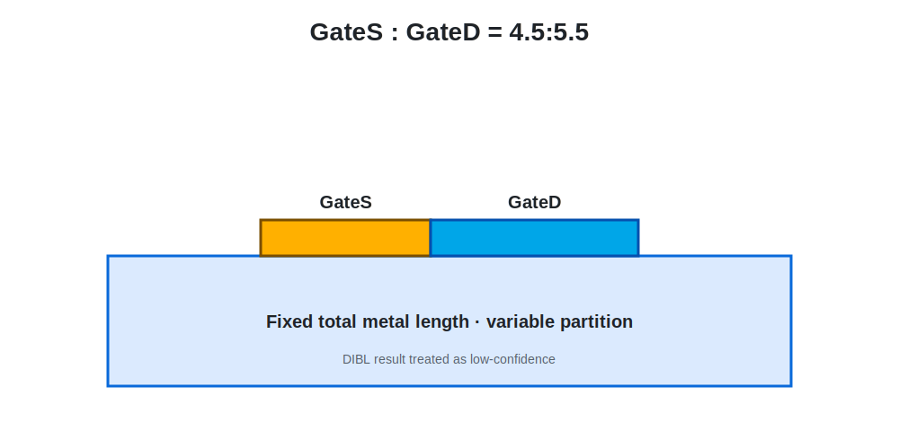<figcaption>GateS:GateD = 4.5:5.5</figcaption></figure>
<figure>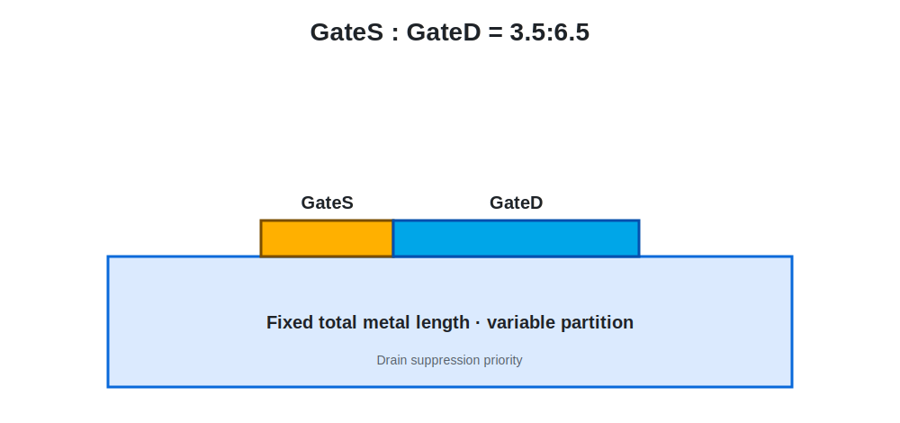<figcaption>GateS:GateD = 3.5:6.5</figcaption></figure>

## Extracted Results

| Ratio | DIBL | SS | Ion | Ioff | Ion/Ioff | IgTotal_On |
|---|---:|---:|---:|---:|---:|---:|
| 6:4 | 19.47 | 86.03 | 1.847e-4 | 2.03e-15 | 9.12e10 | 2.88e-10 |
| 5:5 | 22.35 | 84.85 | 1.842e-4 | 4.30e-16 | 4.29e11 | 2.17e-10 |
| 4.5:5.5 | 2.57* | 84.44 | 1.839e-4 | 2.88e-16 | 6.38e11 | 1.83e-10 |
| 3.5:6.5 | 56.89 | 83.94 | 1.833e-4 | 2.08e-16 | 8.82e11 | 1.17e-10 |

`*` 4.5:5.5의 DIBL은 low-confidence outlier로 분류했습니다.

<figure>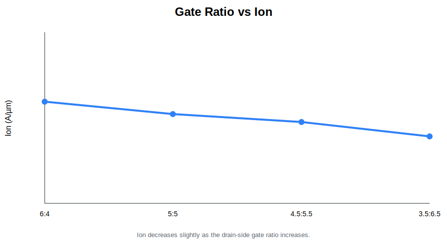<figcaption>Drain-side 비율 증가에 따라 Ion은 소폭 감소.</figcaption></figure>
<figure>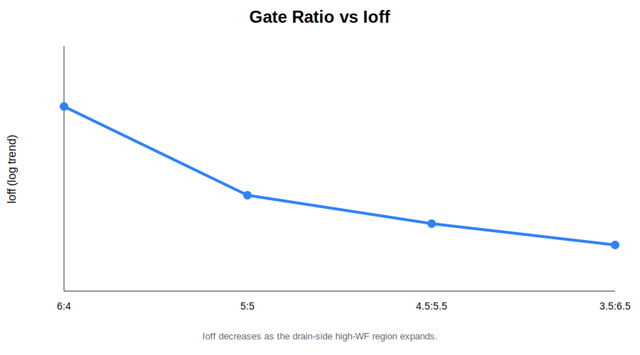<figcaption>Ioff는 감소 경향.</figcaption></figure>
<figure>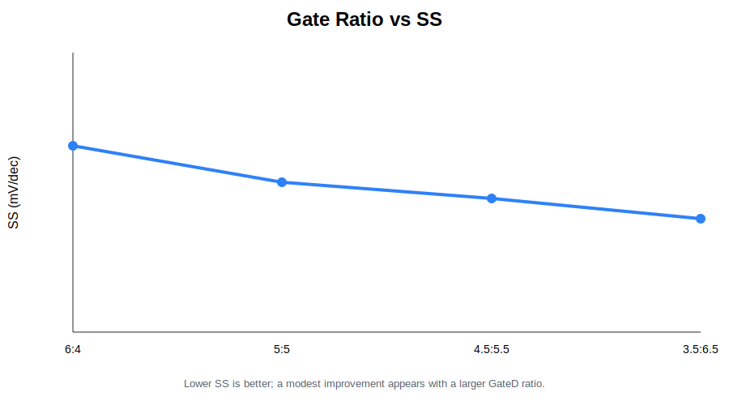<figcaption>SS는 소폭 개선 경향.</figcaption></figure>
<figure>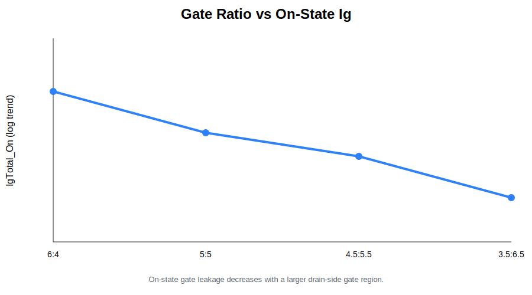<figcaption>IgTotal_On은 감소 경향.</figcaption></figure>
<figure>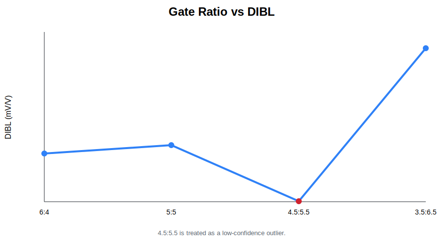<figcaption>DIBL은 비단조적이며 extraction sensitivity를 보임.</figcaption></figure>

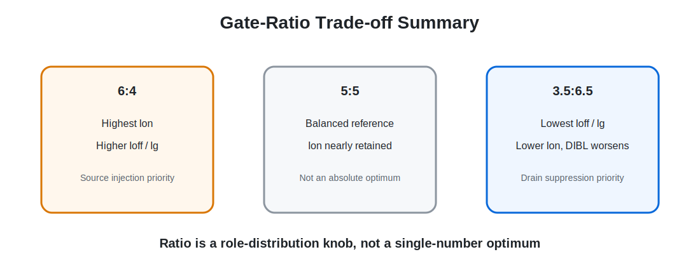

## Why 5:5 Was Used as a Balanced Reference

5:5는 모든 지표에서 최고인 절대 최적점이 아닙니다. 6:4 대비 Ion을 거의 유지하면서 Ioff와 Ig를 낮추고, 3.5:6.5에서 나타난 DIBL 악화를 피한 **균형 기준 조건**으로 해석했습니다.

3.5:6.5는 off-state와 Ig 측면에서 가장 강한 drain suppression을 보여주지만 Ion이 가장 낮고 DIBL이 악화됩니다. 따라서 ratio는 최고 성능을 결정하는 단일 숫자가 아니라 역할 분배에 따른 trade-off knob입니다.
