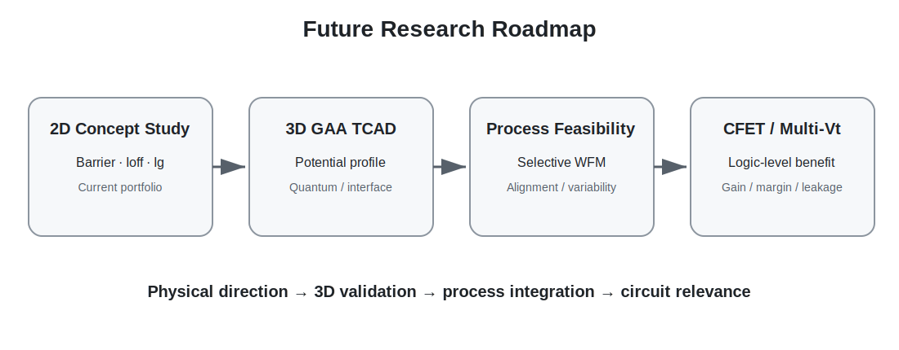

# 11. Conclusion and Future Research

[← Navigation](./00_navigation.html)

## What the Study Supports

1. Source-side low WF와 drain-side high WF를 분리하면 source injection과 drain field suppression의 역할을 나눌 수 있습니다.
2. 세 gate length 비교에서 DMG는 Ion을 소폭 낮추는 대신 Ioff와 Ion/Ioff를 크게 개선하는 방향을 반복적으로 보였습니다.
3. DIBL은 개선 방향을 보였지만 threshold extraction에 민감해, 단일 수치를 절대 성능으로 해석해서는 안 됩니다.
4. Thin-SiO₂의 gate leakage가 추가 한계로 드러났고, 동일 EOT의 High-K stack은 Ig를 크게 줄이는 방향을 보였습니다.
5. Gate ratio는 source injection과 drain suppression 사이의 trade-off를 조절하는 변수입니다.

## Limitations

- 2D planar nMOS test vehicle
- Gate materials와 electrode work function을 분리해 모델링
- DMG gap의 실제 lithography·integration feasibility 미검증
- 3D GAA·CFET selective WFM deposition과 metal filling 미구현
- High-K tunneling parameter의 절대 calibration 미완료
- 발표 raw table 일부에 초기 Vtgm DIBL 포함
- process variability, interface trap, quantum confinement, reliability 미포함

## Future Research Questions

### Device Modeling

- GAA nanosheet 또는 nanowire 3D TCAD에서 lateral/segmented WFM 효과 재검증
- electrostatic potential, conduction-band profile, carrier density를 통한 barrier mechanism 직접 확인
- quantum correction과 interface trap 포함

### Process Feasibility

- limited cavity 안에서 WFM selective deposition·etch-back
- GateS/GateD interface alignment tolerance
- WFM composition/thickness variability
- gap 없이 material transition을 구현하는 integration sequence
- metal filling과 contact resistance

### Circuit Relevance

- CFET nFET/pFET Vt matching
- Multi-Vt library와 low-power logic
- inverter noise margin, gain, static leakage

## Final Statement

본 연구는 2D MOSFET 기반 TCAD 분석을 통해 Dual-Metal Gate의 Work-Function Split 효과와 한계를 함께 확인했습니다. 향후 dual-WFM 공정성 개선과 3D 검증을 거쳐 CFET 기반 Multi-Vt 및 저전력 logic 소자 연구로 확장할 수 있습니다.
