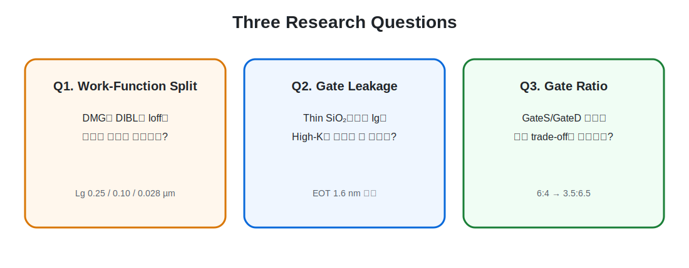
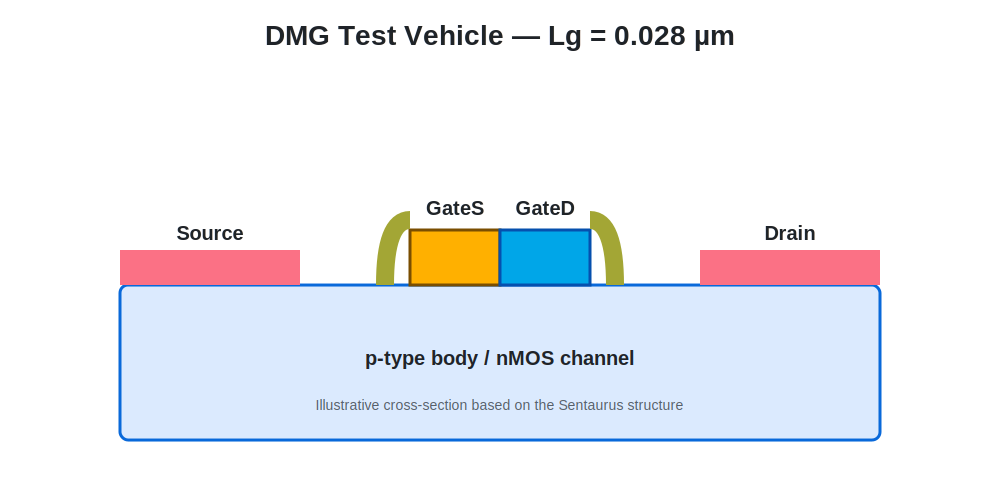

# TCAD Dual-Metal-Gate MOSFET Feasibility Study

**Physical verification of source–drain Work-Function Split, High-K gate stack, and gate-ratio trade-offs**

2D planar nMOS TCAD test vehicle에서 Dual-Metal Gate의 기본 물리 효과를 분리 검증하고, 결과의 신뢰성·누설전류·공정 확장 가능성까지 단계적으로 재검토한 연구입니다.

<a href="./guide/00_navigation.html">Detailed Research</a>
<a href="./guide/12_reproducibility_and_code.html">Full TCAD Code</a>
<a href="./results/README.html">Raw Results</a>
<a href="./presentation/conference_presentation_outline.html">Conference Outline</a>
<a href="./references/bibliography.html">References</a>

## Why This Study?

최신 GAA·nanosheet·CFET에서도 threshold-voltage control을 위한 WFM engineering이 중요하지만, 제한된 공간에서 서로 다른 WFM을 형성하는 공정은 복잡합니다. 본 연구는 최신 3D 공정을 직접 모사했다고 주장하지 않고, **source-side low-WF gate와 drain-side high-WF gate의 역할 분리**가 barrier와 leakage에 미치는 영향을 단순화된 2D 구조에서 검증했습니다.

## Three Research Questions

<strong>Q1. Work-Function Split</strong>DMG가 Single-Metal Gate 대비 DIBL·Ioff 감소 방향을 보이는가?

<strong>Q2. Gate Leakage</strong>Thin SiO₂에서 드러난 Ig를 동일 EOT의 High-K stack으로 줄일 수 있는가?

<strong>Q3. Gate Ratio</strong>GateS/GateD 길이 비율은 source injection과 drain suppression 사이에 어떤 trade-off를 만드는가?

## Key Findings

<strong>3-Scale Verification</strong>Lg 0.25, 0.10, 0.028 µm에서 Ion 소폭 감소와 Ioff 감소 방향을 반복 확인

<strong>DIBL Reliability</strong>Vtgm 특이값을 발견하고 corrected Vtgm과 constant-current threshold를 추가

<strong>High-K Gate Stack</strong>대표 High-Vd 조건에서 IgTotal_On 약 99.40% 감소

<strong>Gate-Ratio Trade-off</strong>Drain-side 비율 증가 시 Ioff·SS·Ig 개선, Ion 소폭 감소, DIBL 비단조 변화

<figure><figcaption>세 gate length에서 확인한 Ioff 방향성. 절대 DIBL 값보다 여러 지표의 반복 경향을 중심으로 해석했습니다.</figcaption></figure>
<figure><figcaption>동일 EOT 조건의 SiO₂와 SiO₂/HfO₂ stack 비교.</figcaption></figure>

## Physical Test Vehicle

<figure><figcaption>Lg = 0.028 µm DMG test structure.</figcaption></figure>
<figure><figcaption>세 gate length의 Single–Dual 비교.</figcaption></figure>

## Project Evolution

수업 기말 프로젝트에서 시작해 scaling 비교를 수행했고, 대회·학회 준비 중 DIBL extraction과 gate leakage 문제를 재검토했습니다. 이후 High-K와 gate-ratio study를 추가하고, 연구 주장을 최신 GAA·CFET WFM engineering 문맥의 **concept study**로 수정했습니다.

[발전 과정 자세히 보기](./guide/02_project_evolution.html)

## Final Interpretation

- DMG는 source injection 유지와 drain field suppression을 분리할 가능성을 보여주었습니다.
- 핵심 가치는 최고 Ion을 만드는 것이 아니라, 제한된 Ion 손실로 Ioff·Ion/Ioff를 개선하는 방향에 있습니다.
- Thin-SiO₂에서 Ig가 새로운 한계로 드러났고 High-K stack이 이를 줄이는 방향을 보였습니다.
- Gate ratio는 하나의 절대 최적값보다 electrostatic role distribution을 조정하는 설계 변수로 해석해야 합니다.

본 연구는 2D planar TCAD concept study입니다. 실제 GAA·CFET dual-WFM 공정의 selective deposition, etch-back, alignment, metal filling과 variability를 실증하지 않았습니다.

## Continue Reading

- [Literature review and research framing](./guide/03_literature_and_research_framing.html)
- [TCAD process and code workflow](./guide/05_tcad_test_vehicle_and_process.html)
- [Scaling verification](./guide/06_scaling_verification.html)
- [DIBL extraction reliability](./guide/07_dibl_extraction_and_reliability.html)
- [High-K gate stack](./guide/09_high_k_gate_stack.html)
- [Gate-ratio trade-off](./guide/10_gate_ratio_tradeoff.html)
- [Reproducibility and full source code](./guide/12_reproducibility_and_code.html)
