# Dual-Metal Gate를 이용한 미세 MOSFET의 SCE 및 Leakage Current 개선 효과 분석

**2D planar MOSFET에서 source–drain Work-Function Split을 검증하고, scaling·parameter screening·gate leakage·High-K·gate-ratio trade-off를 분석한 Sentaurus TCAD 연구**

| Period | Status | Tools |
|---|---|---|
| 2026.03–2026.07 | Conference Presented | Sentaurus Workbench · SProcess · SDevice · SVisual |

**Summary:**  
This conference-presented study uses a 2D Sentaurus TCAD test vehicle to examine lateral work-function splitting, process-parameter screening, gate-leakage mitigation with a high-k stack, and GateS/GateD ratio trade-offs.

<a href="./study/index.html">연구 전체 읽기</a>
<a href="./presentation/final_conference_presentation.pdf">최종 발표자료 보기</a>
<a href="./source/index.html">전체 TCAD 코드</a>
<a href="./results/index.html">결과 데이터</a>

<figure>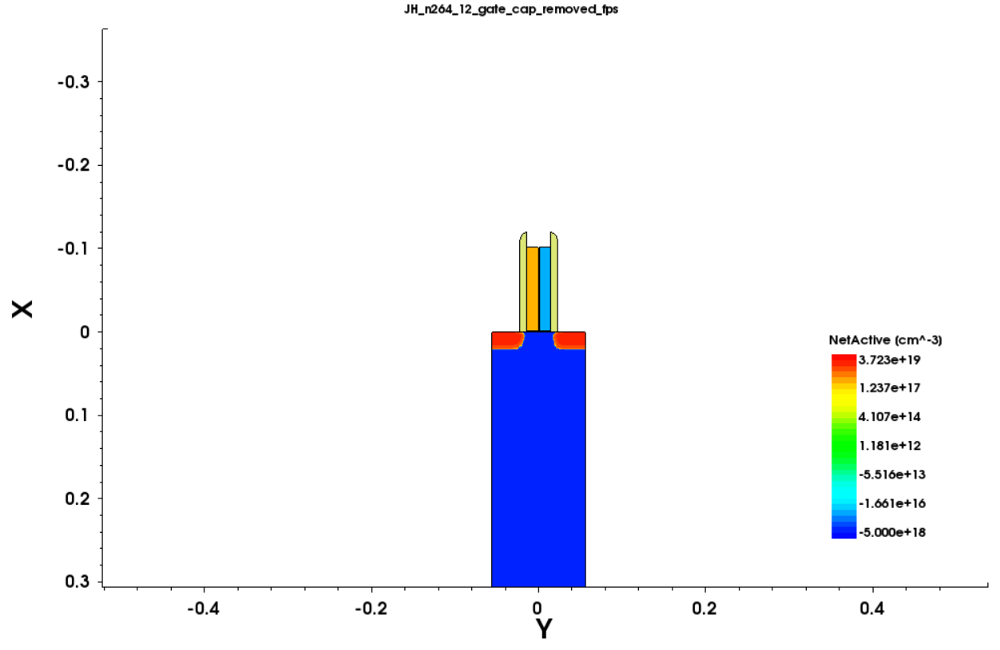<figcaption>Sentaurus SVisual에서 확인한 Lg = 0.028 μm 실제 GateS/GateD 구조.</figcaption></figure>
<figure>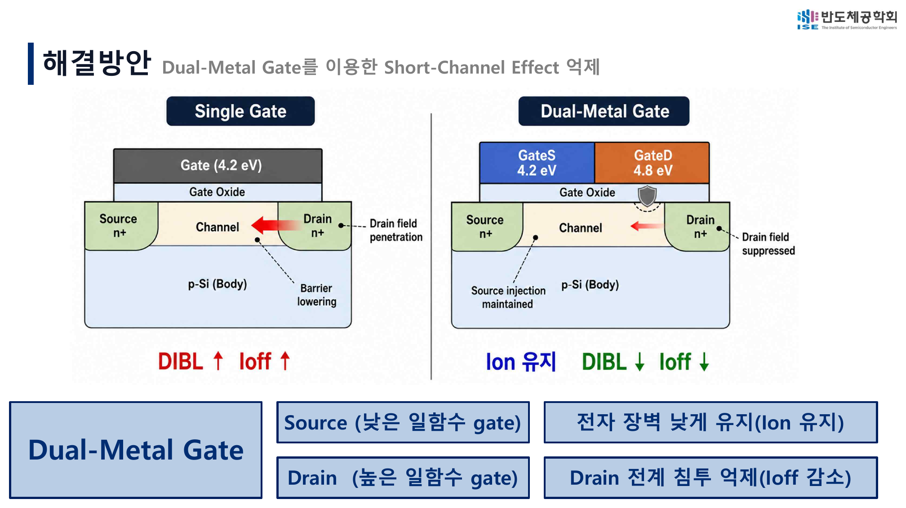<figcaption>최종 발표에서 사용한 Single-Metal Gate와 Dual-Metal Gate의 역할 비교.</figcaption></figure>

<strong>이 프로젝트의 중심 질문</strong> 
Source 측 low-WF gate와 Drain 측 high-WF gate의 역할을 분리하면, 제한된 Ion 손실로 DIBL·Ioff를 낮출 수 있는가?

---

## 연구 진행 흐름

01<strong>연구 배경과 가설</strong>
미세화에 따른 SCE·DIBL·Ioff 문제와 Work-Function Split 가설 설정

02<strong>TCAD 공정 구현</strong>
SimpleMOS 기반 GateS/GateD, DMG gap과 protective cap 구현

03<strong>Scaling과 조건 선정</strong>
Lg 0.25 → 0.10 → 0.028 μm 검증 및 comparative optimization

04<strong>Gate leakage와 High-K</strong>
Thin-SiO₂ Ig 문제 발견 후 동일 EOT의 SiO₂ IL/HfO₂ 적용

05<strong>Gate-ratio trade-off</strong>
GateS:GateD = 6:4 → 3.5:6.5에서 역할 분배와 한계 분석

[최종 발표 순서로 전체 연구 읽기 →](./study/index.html)

---

## 1. 연구 배경과 DMG 가설

MOSFET 미세화는 drain 전계가 source-channel barrier에 미치는 영향을 키워 DIBL과 off-state leakage를 증가시킬 수 있습니다. 본 연구는 gate를 lateral direction으로 분리했습니다.

| Region | WF | Role |
|---|---:|---|
| GateS, source side | 4.2 eV | carrier injection 유지 |
| GateD, drain side | 4.8 eV | drain field penetration과 barrier lowering 억제 |

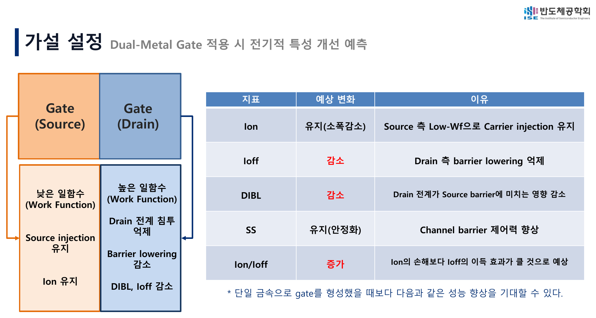

예상한 방향은 **Ion 유지 또는 소폭 감소, Ioff와 DIBL 감소, Ion/Ioff 증가**였습니다.

---

## 2. 실제 TCAD 구현

SProcess에서 GateS와 GateD를 별도 region으로 형성하고, 두 metal 사이의 작은 `DMG_Gap`과 implant 보호용 temporary cap을 구현했습니다. SDevice에서는 두 gate에 독립적인 work function을 부여하고 Low-Vd와 High-Vd Id–Vg를 계산했습니다.

<figure>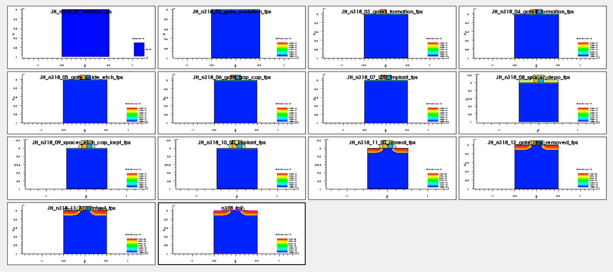<figcaption>실제 SProcess checkpoint를 연결한 공정 흐름.</figcaption></figure>
<figure>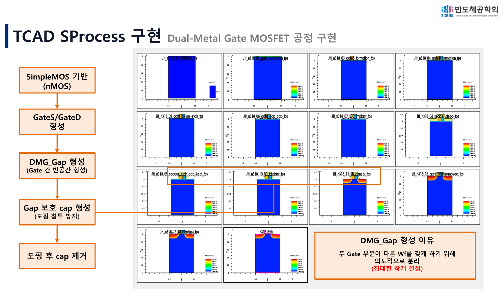<figcaption>최종 발표의 공정 구현 설명.</figcaption></figure>

[구현 방법과 실제 코드 보기 →](./appendix/reproducibility.html)

---

## 3. 세 gate length의 검증과 parameter screening

각 scale에서 NWell, LDD dose/energy와 Source/Drain dose/energy를 screening하고, `Ion/Ioff–DIBL` 분포와 SS·Ion을 함께 비교해 representative condition을 선정했습니다.

<article>
<h3>Lg = 0.25 μm</h3>
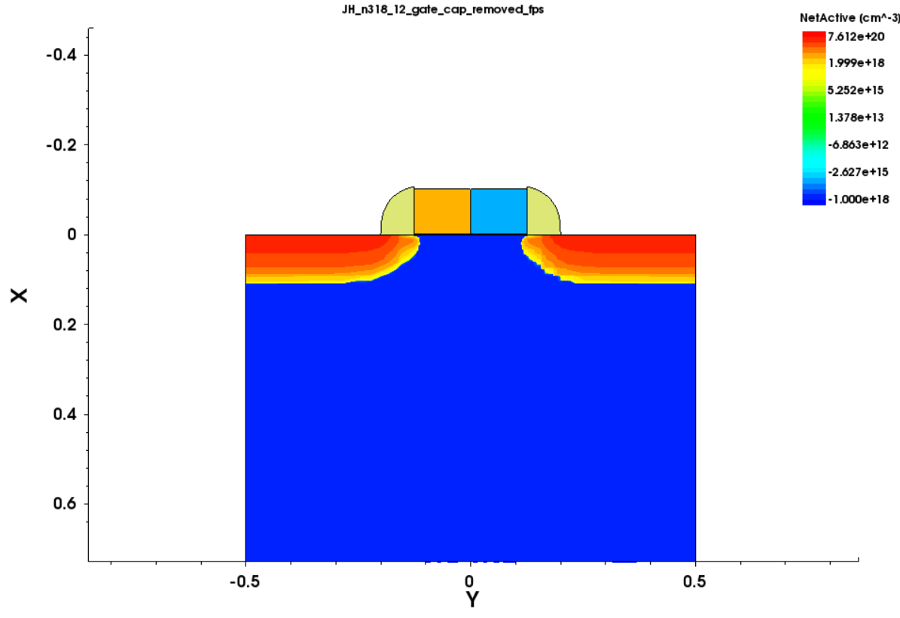

첫 DMG 효과 검증과 screening 방식 수립.

</article>
<article>
<h3>Lg = 0.10 μm</h3>
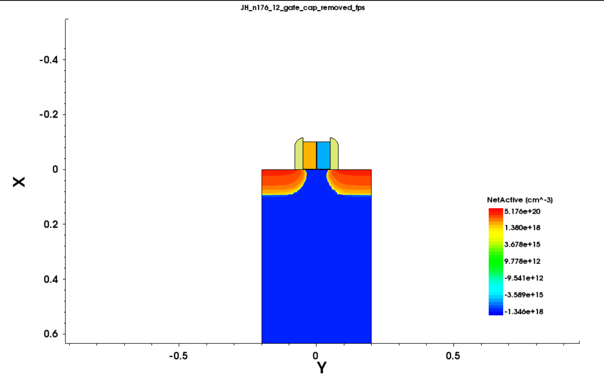

gate length 감소 후 동일 방향 재검증.

</article>
<article>
<h3>Lg = 0.028 μm</h3>

구조 안정성을 포함한 미세화 적용성 확인.

</article>

### 반복된 결과 방향

| Metric | DMG direction |
|---|---|
| Ion | 소폭 감소 |
| Ioff | 큰 폭 감소 |
| Ion/Ioff | 큰 폭 증가 |
| DIBL | 감소 방향이나 extraction에 민감 |
| SS | 조건별 trade-off |

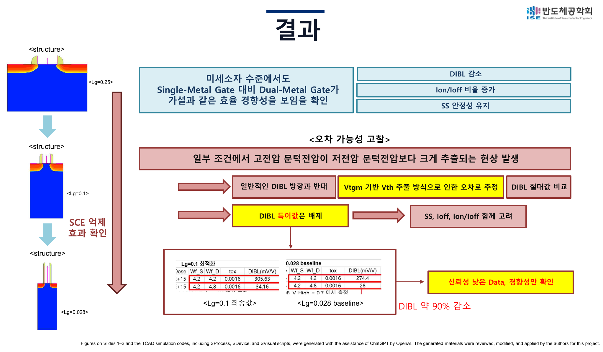

이 과정은 global optimum을 주장하는 작업이 아니라, 여러 scale에서 DMG의 상대적 물리 효과를 확인하기 위한 **parameter screening and comparative optimization**입니다.

[최적화 지점 선정 과정 자세히 보기 →](./appendix/optimization_details.html)

---

## 4. Gate leakage 문제와 High-K 개선

Lg = 0.028 μm의 약 1.6 nm SiO₂에서는 DMG로 drain Ioff를 줄여도 on-state gate tunneling이 남았습니다. GateS와 GateD current를 별도로 추출한 뒤, EOT를 유지하면서 물리 두께를 늘리는 SiO₂ IL/HfO₂ stack을 적용했습니다.

<figure>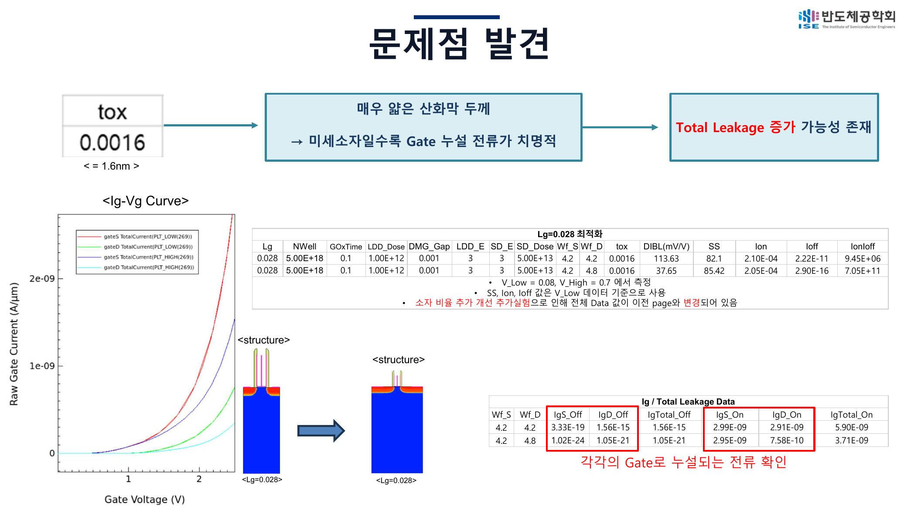<figcaption>Drain-current 평가 이후 추가로 발견한 Gate leakage 문제.</figcaption></figure>
<figure>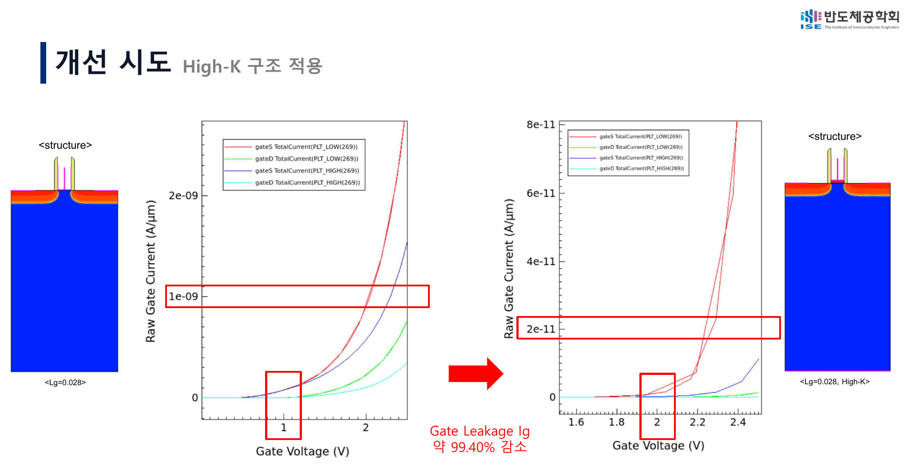<figcaption>동일 EOT의 High-K 적용 후 Ig 비교.</figcaption></figure>

| Stack | EOT | Physical thickness | IgTotal On, High-Vd |
|---|---:|---:|---:|
| SiO₂ | 1.6 nm | 1.6 nm | 1.8897e-9 A/μm |
| SiO₂ IL/HfO₂ | 1.5998 nm | 6.14 nm | 1.135e-11 A/μm |

대표 High-Vd 조건에서 IgTotal_On은 약 **99.40% 감소**했습니다. 이 결과는 calibrated absolute prediction이 아니라 동일 simulation framework 안의 first-pass relative comparison입니다.

---

## 5. GateS/GateD ratio trade-off

총 gate region을 유지하면서 GateS:GateD를 6:4, 5:5, 4.5:5.5, 3.5:6.5로 바꿨습니다.

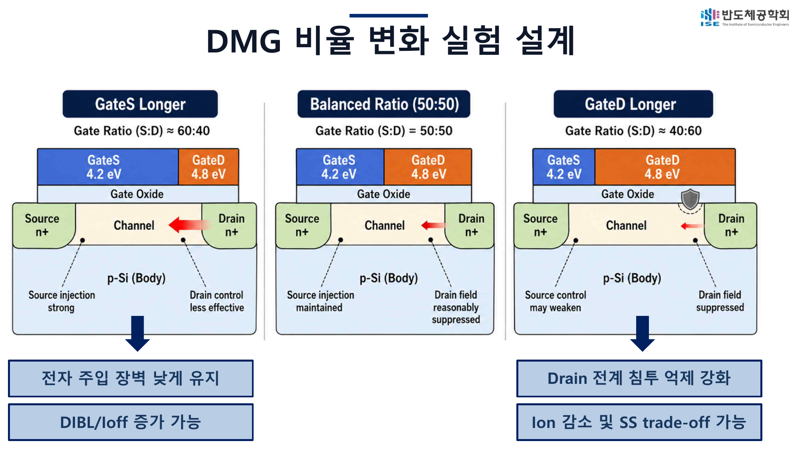

Drain-side high-WF 영역이 커질수록 Ioff·Ig·SS는 개선되는 방향을 보였지만, GateS가 짧아져 Ion이 소폭 감소했고 DIBL은 비단조적으로 변했습니다.

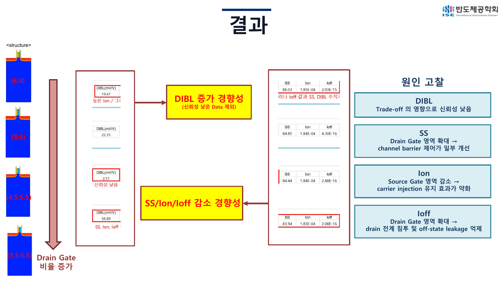

**5:5는 절대 최적점이 아니라 balanced reference condition**입니다. 4.5:5.5의 매우 낮은 DIBL은 low-confidence outlier로 분류했습니다.

---

## 핵심 결론

1. Source-side low WF와 drain-side high WF의 역할 분리 가능성을 확인했습니다.
2. 세 gate length에서 DMG는 Ion 일부 손실과 함께 Ioff·Ion/Ioff 개선 방향을 반복적으로 보였습니다.
3. DIBL 특이값을 발견하고 결과를 여러 지표와 함께 해석하는 신뢰성 정책을 도입했습니다.
4. Thin-SiO₂ gate leakage를 발견하고 High-K stack으로 완화 가능성을 확인했습니다.
5. Gate ratio는 단일 최적값이 아니라 source injection과 drain suppression의 trade-off knob입니다.

<strong>연구 범위:</strong> 본 결과는 2D planar TCAD test vehicle의 상대 비교입니다. 실제 GAA·CFET dual-WFM deposition, etch-back, alignment, metal filling과 variability를 실증한 결과가 아닙니다.

---

## 최종 발표자료와 기술 자료

<a class="resource-card" href="./presentation/final_conference_presentation.pdf"><strong>Final Presentation PDF</strong>26장 최종 학회 발표자료를 브라우저에서 확인</a>
<a class="resource-card" href="./presentation/final_conference_presentation.pptx"><strong>Original PPTX</strong>원본 발표파일 다운로드</a>
<a class="resource-card" href="./study/index.html"><strong>Full Study</strong>발표 순서로 정리한 전체 연구 본문</a>
<a class="resource-card" href="./appendix/optimization_details.html"><strong>Optimization Details</strong>세 gate length의 parameter screening과 선정 과정</a>
<a class="resource-card" href="./appendix/data_lineage_and_reliability.html"><strong>Data & Reliability</strong>데이터 단계와 DIBL extraction 신뢰성</a>
<a class="resource-card" href="./appendix/reproducibility.html"><strong>Full TCAD Source</strong>코드 세트, 실행 순서와 재현 범위</a>

## AI assistance disclosure

OpenAI ChatGPT는 TCAD command 초안·수정, debugging 방향, metric-extraction logic, 데이터 비교, 발표 및 포트폴리오 구조화를 보조했습니다. 모든 simulation result는 Sentaurus Workbench에서 직접 실행한 log, TDR, curve와 DOE output을 확인해 사용했습니다.
