# 발표 흐름으로 읽는 전체 연구

[← 프로젝트 첫 페이지](../index.html) · [최종 발표 PDF](../presentation/final_conference_presentation.pdf) · [원본 PPTX](../presentation/final_conference_presentation.pptx)

이 문서는 최종 학회 발표의 전개 순서를 기준으로 연구 배경부터 결론까지 한 페이지에서 읽을 수 있도록 정리한 본문입니다. 세부 parameter screening, 데이터 단계 구분, 발표 이후 DIBL 재검증은 별도 부록으로 연결합니다.

> **연구 성격**  
> 본 연구는 2D planar nMOS test vehicle에서 source–drain 방향 Work-Function Split의 물리적 효과를 확인한 feasibility and comparative study입니다. 생산 가능한 planar DMG 공정이나 실제 GAA·CFET 성능을 완성했다고 주장하지 않습니다.

---

## 1. 기술 동향과 연구 필요성

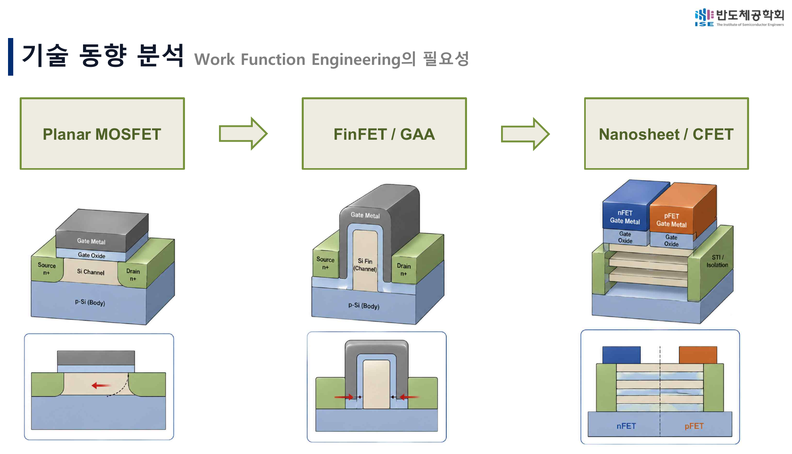

MOSFET 미세화 과정에서 planar 구조는 FinFET과 GAA로 발전했고, nanosheet와 CFET에서는 제한된 공간 안에서 여러 threshold-voltage option을 구현하기 위한 Work-Function Metal engineering이 중요해졌습니다. 그러나 WFM deposition, etch, alignment와 variability 제어는 동시에 어려워집니다.

선행연구에서는 다음 가능성을 확인했습니다.

- multi-Vt 구현을 위한 WFM modification의 필요성
- dual-material 또는 dual-metal gate에 의한 DIBL 감소 가능성
- gate partition 또는 길이 비율에 따라 전기적 특성이 달라질 가능성
- 최신 GAA·CFET에서도 Work-Function Engineering이 계속 연구되는 흐름

이 연구는 최신 3D 구조를 직접 재현하기보다, 복잡한 integration 문제로 확장하기 전에 **서로 다른 WF를 source와 drain 방향으로 나누었을 때의 electrostatic directionality**를 2D test vehicle에서 분리해 확인했습니다.

---

## 2. 연구 질문과 DMG 가설

Gate length가 감소하면 drain 전계가 source-channel barrier에 더 강하게 영향을 주어 DIBL과 off-state leakage가 증가할 수 있습니다. 이를 완화하기 위해 source 측과 drain 측 gate의 역할을 나누었습니다.


| Gate region | Work function | Intended role |
|---|---:|---|
| GateS, source side | 4.2 eV | source injection barrier를 낮게 유지해 Ion 손실 제한 |
| GateD, drain side | 4.8 eV | drain field penetration과 barrier lowering 억제 |


초기 가설은 다음과 같습니다.

| Metric | Expected direction | Physical interpretation |
|---|---|---|
| Ion | 유지 또는 소폭 감소 | GateS의 low WF가 carrier injection을 유지 |
| Ioff | 감소 | GateD의 high WF가 drain-side barrier lowering 억제 |
| DIBL | 감소 방향 | drain 전계가 source barrier에 미치는 영향 완화 |
| SS | 유지 또는 trade-off | channel barrier control과 gate partition의 복합 영향 |
| Ion/Ioff | 증가 | 제한된 Ion 손실보다 Ioff 감소 효과가 클 가능성 |

DIBL은 Low-Vd와 High-Vd의 Id–Vg curve에서 threshold voltage를 각각 추출해 계산했습니다.

```text
DIBL = |Vth,LowVd − Vth,HighVd| / |Vd,High − Vd,Low|
```

대표 bias는 `Vd_Low = 0.08 V`, `Vd_High = 0.70 V`입니다.

---

## 3. Sentaurus TCAD 구현


Synopsys Sentaurus T-2022.03의 Workbench, SProcess, SDevice, SVisual을 사용했습니다.

### SProcess

- SimpleMOS 기반 2D nMOS 구조에서 GateS와 GateD를 별도 material region으로 형성
- 서로 다른 work function을 부여하기 위한 작은 `DMG_Gap` 유지
- implant가 gate 사이 공간으로 침투하지 않도록 temporary protective cap 적용
- LDD, Source/Drain implant와 anneal 후 cap 제거
- GateS와 GateD contact 분리


### SDevice

- GateS와 GateD에 독립적인 work function 지정
- 두 gate에 동일한 gate voltage를 인가해 동시 sweep
- Low-Vd와 High-Vd Id–Vg 계산
- gate-leakage 단계에서는 GateS/GateD별 NonLocal tunneling mesh 추가

### SVisual

- Vth, SS, gm, Ion, Ioff, Ion/Ioff, DIBL 자동 추출
- 후속 단계에서 IgS, IgD, IgTotal과 corrected Vtgm, constant-current Vth까지 확장

[전체 TCAD 코드 보기](../source/index.html)

---

## 4. Lg = 0.25 μm: 1차 검증과 parameter screening

첫 단계에서는 DMG의 기본 효과를 확인하고, 공정조건 변화 속에서도 비교가 가능한 representative condition을 선택했습니다.

<div class="image-grid">
<figure><figcaption>Lg = 0.25 μm 실제 GateS/GateD 구조.</figcaption></figure>
<figure>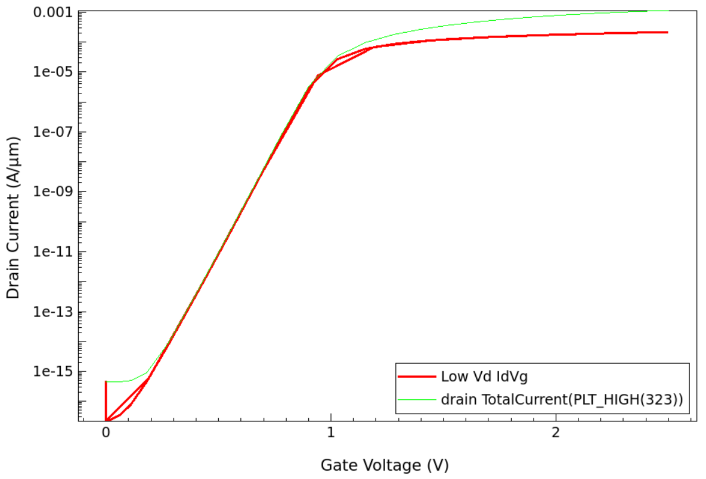<figcaption>Low-Vd와 High-Vd transfer curve.</figcaption></figure>
</div>

### Baseline comparison

| Gate | DIBL (mV/V) | SS (mV/dec) | Ion (A/μm) | Ioff (A/μm) | Ion/Ioff |
|---|---:|---:|---:|---:|---:|
| Single 4.2/4.2 eV | 400.77 | 67.73 | 2.79e-4 | 2.02e-9 | 1.38e5 |
| Dual 4.2/4.8 eV | 328.43 | 68.78 | 2.56e-4 | 1.15e-16 | 2.23e12 |

NWell, LDD dose/energy, Source/Drain dose/energy를 바꾸며 `Ion/Ioff–DIBL` 분포와 SS·Ion 손실을 함께 비교했습니다.

<div class="image-grid">
<figure>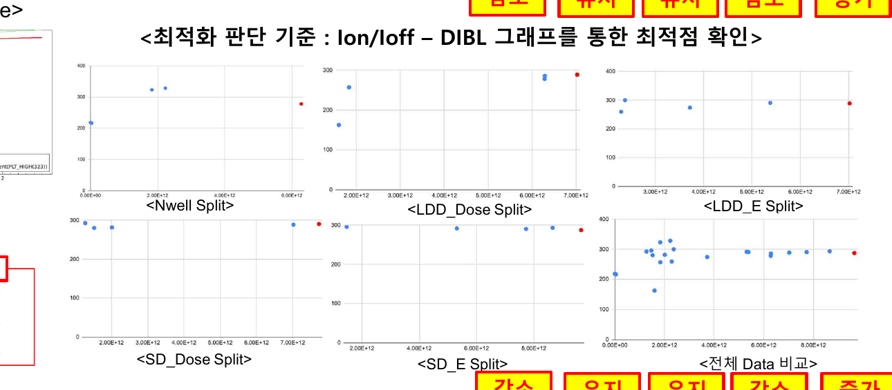<figcaption>발표에서 사용한 parameter screening 결과.</figcaption></figure>
<figure>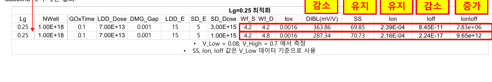<figcaption>선정 조건과 baseline 대비 결과.</figcaption></figure>
</div>

이 단계의 목적은 절대적인 최적 공정을 주장하는 것이 아니라, **동일 공정조건에서 Single과 Dual을 공정하게 비교할 수 있는 조건을 정하고 DMG 방향성을 검증하는 것**입니다.

---

## 5. Lg = 0.10 μm: 효과 재검증

두 번째 단계에서는 gate length를 줄인 상태에서도 동일한 방향이 반복되는지 확인했습니다.

<div class="image-grid">
<figure><figcaption>Lg = 0.10 μm 실제 GateS/GateD 구조.</figcaption></figure>
<figure>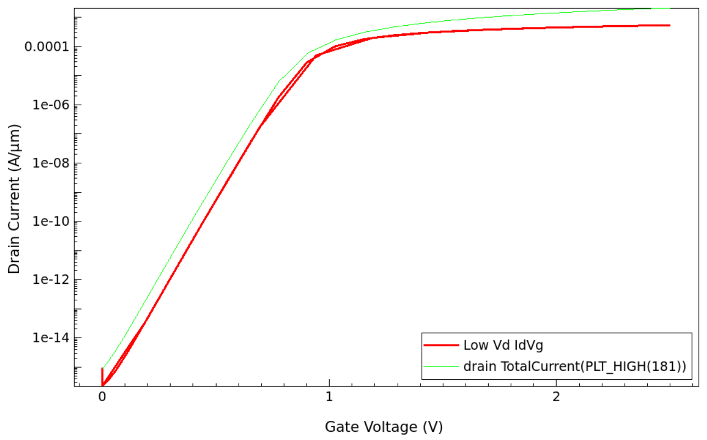<figcaption>Low-Vd와 High-Vd transfer curve.</figcaption></figure>
</div>

### Baseline comparison

| Gate | DIBL (mV/V) | SS (mV/dec) | Ion (A/μm) | Ioff (A/μm) | Ion/Ioff |
|---|---:|---:|---:|---:|---:|
| Single 4.2/4.2 eV | 224.45 | 69.69 | 5.21e-4 | 1.69e-8 | 3.08e4 |
| Dual 4.2/4.8 eV | 206.24 | 76.59 | 4.84e-4 | 2.16e-15 | 2.24e11 |

<div class="image-grid">
<figure>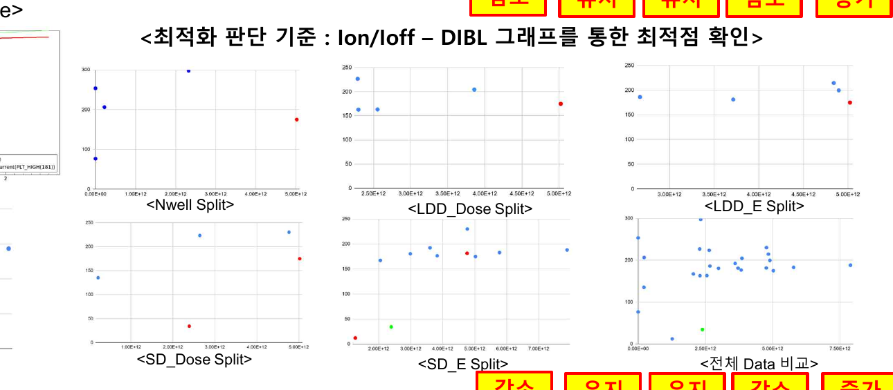<figcaption>Lg = 0.10 μm parameter screening.</figcaption></figure>
<figure><figcaption>선정 조건과 Single–Dual 비교.</figcaption></figure>
</div>

선정 조건에서도 DMG는 Ion을 일부 낮추는 대신 Ioff와 Ion/Ioff를 크게 개선하는 방향을 보였습니다.

---

## 6. Lg = 0.028 μm: 미세화 적용성 검증

세 번째 단계는 단순 scaling뿐 아니라, 미세 구조가 공정 simulation에서 붕괴하지 않는 baseline을 먼저 찾는 과정이 포함됐습니다.

<div class="image-grid">
<figure><figcaption>Lg = 0.028 μm 실제 GateS/GateD 구조.</figcaption></figure>
<figure>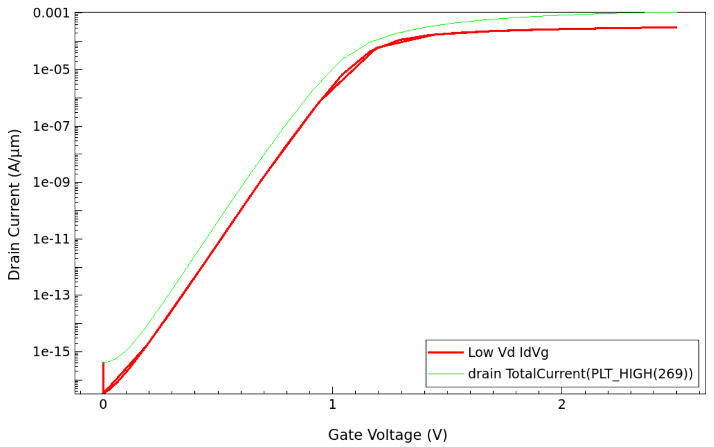<figcaption>Low-Vd와 High-Vd transfer curve.</figcaption></figure>
</div>

### Scaling-stage baseline comparison

| Gate | DIBL (mV/V) | SS (mV/dec) | Ion (A/μm) | Ioff (A/μm) | Ion/Ioff |
|---|---:|---:|---:|---:|---:|
| Single 4.2/4.2 eV | 274.40 | 81.44 | 6.19e-4 | 1.70e-11 | 3.64e7 |
| Dual 4.2/4.8 eV | 28.00* | 85.44 | 5.71e-4 | 1.49e-16 | 3.84e12 |

`*` 이 DIBL은 초기 Vtgm extraction에 민감한 값이므로 절대 성능값이 아니라 경향 확인용으로만 사용합니다.

<div class="image-grid">
<figure>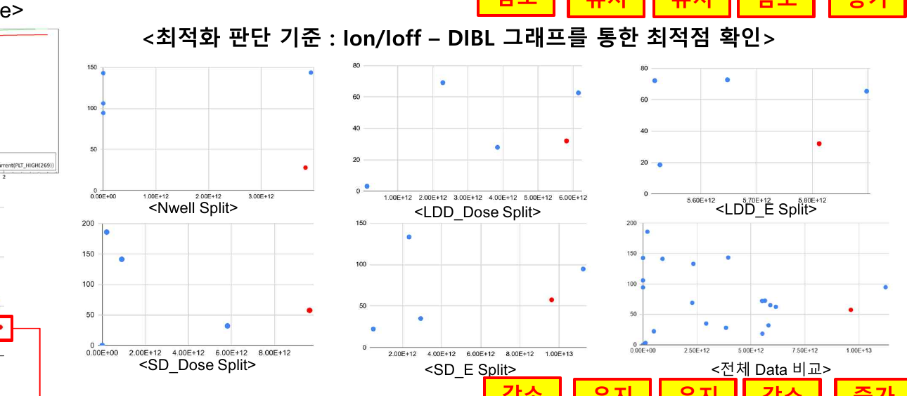<figcaption>구조 안정성을 포함한 parameter screening.</figcaption></figure>
<figure>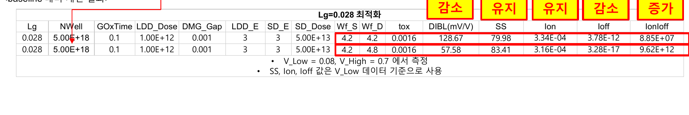<figcaption>Scaling-stage selected condition.</figcaption></figure>
</div>

세 gate length에서 반복된 핵심 방향은 다음과 같습니다.

- Ion: 소폭 감소
- Ioff: 큰 폭 감소
- Ion/Ioff: 큰 폭 증가
- DIBL: 대체로 감소 방향이나 extraction에 민감
- SS: 조건에 따른 trade-off 존재


---

## 7. DIBL 특이값과 결과 신뢰성

일부 조건에서 `Vtgm_High > Vtgm_Low`가 나타나 일반적인 DIBL 방향과 반대인 값이 추출됐습니다. 발표 단계에서는 이 값을 구조 성능으로 단정하지 않고, 다음 원칙으로 결론 범위를 제한했습니다.

1. 극단적인 DIBL 하나만으로 조건을 선정하지 않음
2. SS, Ion, Ioff, Ion/Ioff를 함께 해석
3. 신뢰성이 낮은 특이값은 별도 표시
4. 결론을 절대값보다 반복되는 방향성으로 제한

발표 이후에는 corrected Vtgm과 constant-current threshold를 추가해 extraction 자체를 재검증했습니다. 이는 [데이터 단계와 신뢰성 부록](../appendix/data_lineage_and_reliability.html)에서 따로 설명합니다.

---

## 8. 추가 문제 발견: Thin-SiO₂ gate leakage

DMG가 drain-current 기반 Ioff를 낮추더라도, 약 1.6 nm SiO₂에서는 direct tunneling에 의한 gate current가 새로운 한계가 될 수 있습니다.


GateS와 GateD의 terminal current를 분리해 다음과 같이 정의했습니다.

```text
IgTotal = |I(gateS)| + |I(gateD)|
```

### Leakage-follow-up condition

| Gate | Ioff (A/μm) | IgTotal_On, Low-Vd | IgTotal_On, High-Vd |
|---|---:|---:|---:|
| Single 4.2/4.2 eV | 2.22e-11 | 5.90e-9 | 2.79e-9 |
| Dual 4.2/4.8 eV | 2.90e-16 | 3.71e-9 | 1.89e-9 |

이 값은 앞의 scaling-stage Lg = 0.028 μm 값과 동일한 행으로 합치지 않습니다. 발표자료에서도 추가 geometry/ratio 개선 이후 전체 값이 변경됐음을 명시하고 있습니다.

정확한 해석은 “DMG로 leakage가 모두 해결됐다”가 아니라, **drain Ioff가 줄어든 뒤 gate dielectric leakage가 새 한계로 드러났다**는 것입니다.

---

## 9. High-K gate stack 적용

EOT를 약 1.6 nm로 유지하면서 물리 두께를 증가시키기 위해 SiO₂ interfacial layer와 HfO₂를 적용했습니다.

```text
Original: Si / SiO₂ 1.6 nm / DMG
High-K : Si / SiO₂ IL 0.5 nm / HfO₂ 5.64 nm / DMG
Physical thickness = 6.14 nm
EOT ≈ 1.60 nm
```

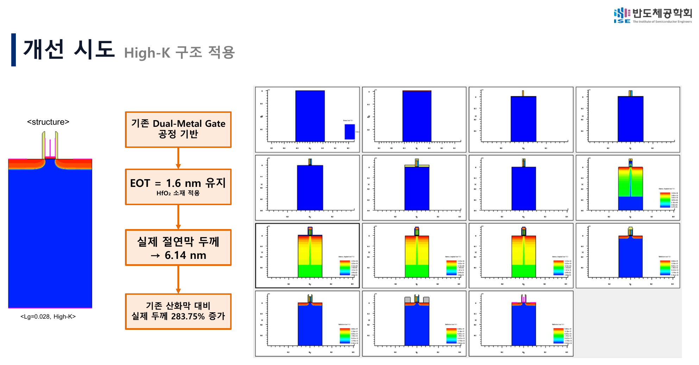


| Bias | SiO₂ IgTotal_On | High-K IgTotal_On | Reduction |
|---|---:|---:|---:|
| Low-Vd | 3.7051e-9 | 2.1700e-10 | 94.14% |
| High-Vd | 1.8897e-9 | 1.1350e-11 | 99.40% |

이 결과는 동일 simulation framework 안의 relative first-pass comparison입니다. HfO₂ tunneling mass, interface trap, band offset와 process damage를 모두 calibration한 절대 leakage prediction은 아닙니다.

---

## 10. GateS/GateD 길이 비율 실험

다음 단계에서는 총 gate region과 gap을 유지하면서 GateS와 GateD의 길이 비율을 바꿨습니다.


| GateS:GateD | GateS length | GateD length |
|---|---:|---:|
| 6:4 | 16.20 nm | 10.80 nm |
| 5:5 | 13.50 nm | 13.50 nm |
| 4.5:5.5 | 12.15 nm | 14.85 nm |
| 3.5:6.5 | 9.45 nm | 17.55 nm |

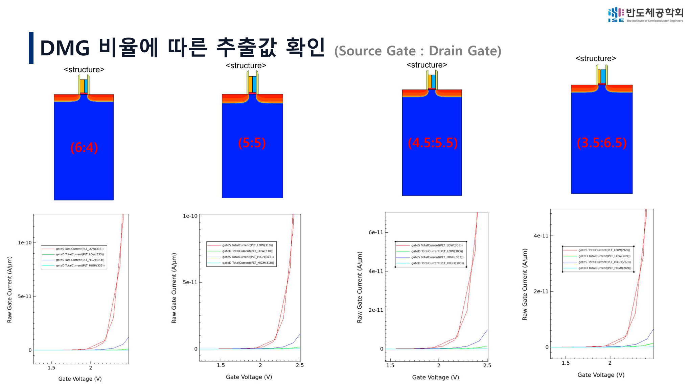

### Extracted results

| Ratio | DIBL (mV/V) | SS (mV/dec) | Ion (A/μm) | Ioff (A/μm) | Ion/Ioff | IgTotal_On |
|---|---:|---:|---:|---:|---:|---:|
| 6:4 | 19.47 | 86.03 | 1.847e-4 | 2.03e-15 | 9.12e10 | 2.88e-10 |
| 5:5 | 22.35 | 84.85 | 1.842e-4 | 4.30e-16 | 4.29e11 | 2.17e-10 |
| 4.5:5.5 | 2.57* | 84.44 | 1.839e-4 | 2.88e-16 | 6.38e11 | 1.83e-10 |
| 3.5:6.5 | 56.89 | 83.94 | 1.833e-4 | 2.08e-16 | 8.82e11 | 1.17e-10 |

`*` 4.5:5.5의 DIBL은 low-confidence outlier로 분류합니다.

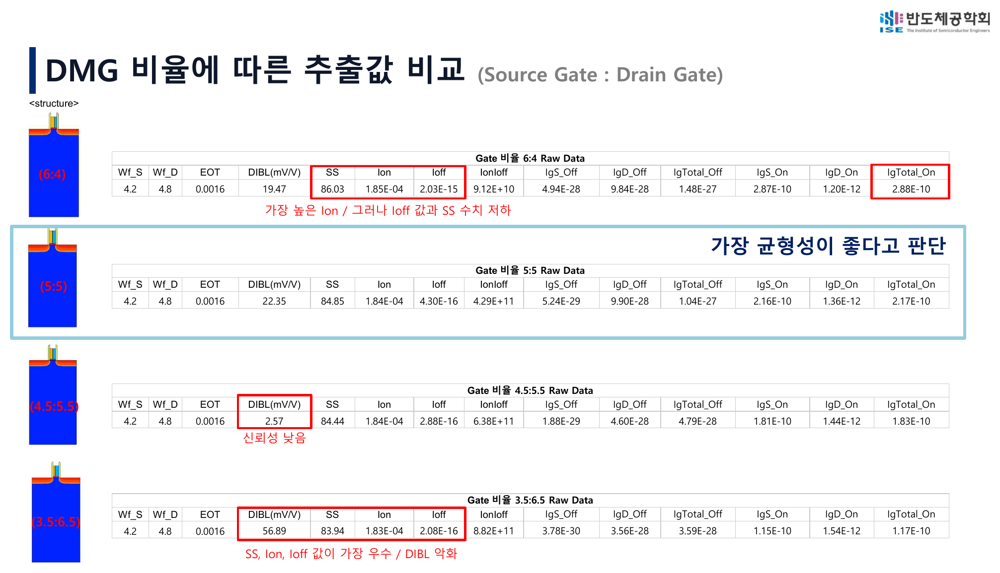


Drain-side high-WF 영역이 증가할수록 다음 경향이 나타났습니다.

- Ioff 감소
- IgTotal_On 감소
- SS 소폭 개선
- Ion 소폭 감소
- DIBL 비단조 변화

5:5는 모든 지표의 최고점이 아니라, 6:4 대비 Ion을 거의 유지하면서 Ioff와 Ig를 낮추고 3.5:6.5의 DIBL 악화를 피한 **balanced reference condition**입니다.

---

## 11. 최종 결론과 한계

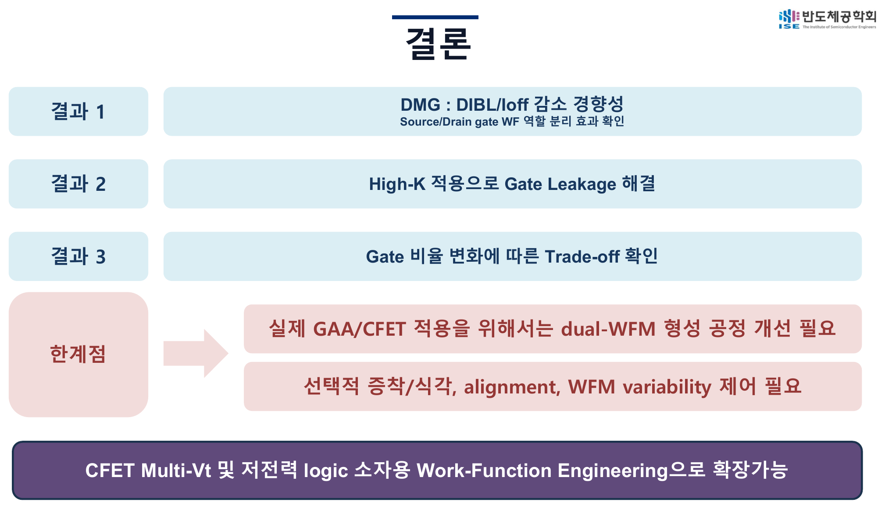

### 연구가 지지하는 결론

1. Source-side low WF와 drain-side high WF를 분리하면 source injection과 drain field suppression의 역할을 나눌 수 있습니다.
2. 세 gate length에서 DMG는 Ion을 일부 낮추는 대신 Ioff와 Ion/Ioff를 개선하는 방향을 반복적으로 보였습니다.
3. Thin-SiO₂에서는 gate leakage가 추가 한계로 드러났고, 동일 EOT의 High-K stack은 Ig를 낮추는 방향을 보였습니다.
4. Gate ratio는 하나의 절대 최적값이 아니라 source injection과 drain suppression 사이의 trade-off를 조정하는 변수입니다.
5. DIBL은 extraction method에 민감하므로 여러 지표와 함께 해석해야 합니다.

### 한계

- 2D planar nMOS test vehicle
- 실제 dual-WFM selective deposition, etch-back와 alignment 미검증
- GateS/GateD transition과 variability 미검증
- High-K tunneling absolute calibration 미완료
- quantum confinement, interface trap, process variation 미포함
- GAA·CFET 적용은 후속 연구 방향이며 본 연구의 직접 simulation 결과가 아님

---

## 12. 발표 이후 추가 검증

최종 학회 발표 이후, 초기 Vtgm 기반 DIBL 특이값을 더 엄밀히 점검하기 위해 다음 기능을 추가했습니다.

- gm extrapolation에 `−Vd/2` correction 적용
- constant-current Vth (`1e-7`, `1e-8 A/μm`) 추가
- threshold crossing valid flag
- signed DIBL과 absolute DIBL 동시 출력
- 결과를 SS, Ion, Ioff, Ion/Ioff, Ig와 함께 비교

이 후속 검증은 발표 내용을 사후에 바꿔 쓰는 것이 아니라, 발표에서 발견한 신뢰성 문제를 추적한 연구 발전 과정입니다.

---

## 더 보기

- [최적화 과정 상세](../appendix/optimization_details.html)
- [데이터 단계와 DIBL 신뢰성](../appendix/data_lineage_and_reliability.html)
- [재현 방법과 전체 코드](../appendix/reproducibility.html)
- [최종 발표자료](../presentation/README.html)
- [결과 데이터](../results/index.html)
- [참고문헌](../references/bibliography.html)
